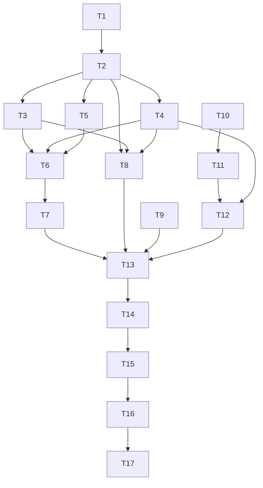

# Study: Audio Intelligence for Feature #5 (Scene Energy Auto-DJ), Feature #7 (Multi-Band Control Matrix), Feature #12 (Latency-Calibrated Mode)
Date: 2026-02-15  
Depth: Full  
Method: Decomposition -> breadth-first search -> quality filtering -> cross-verification -> hypothesis tracking -> self-critique.

## Executive Summary
- A practical low-latency stack is feasible with block-based DSP on the audio thread (or AudioWorklet), with section logic on a slower control thread. Use causal frame features (energy, band power, flux, onset, beat phase proxy) for responsive visuals and keep long-horizon segmentation out of the callback path. [S1][S2][S4][S5]
- For `calm/groove/drop`, a 3-state model should combine frame features with temporal smoothing: confidence fusion + dual-threshold hysteresis + minimum dwell + cooldown. This is the most robust anti-chatter design found across event-detection practice. [S11][S12][S15][S16]
- Latency-calibrated mode should be hybrid: (1) read engine/device-reported latency, (2) measure end-to-end offset via loopback + GCC-PHAT, (3) apply online phase/jitter correction with bounded control updates. [S1][S17][S19][S20][S21][S22]

## Sub-Questions Investigated
1. Which real-time audio features are reliable under tight latency budgets?
2. How should section classification (`calm/groove/drop`) be designed for stability and confidence reporting?
3. How should spectral/onset/beat signals map to visual parameters in a controllable matrix?
4. How should latency be estimated, calibrated, and phase-corrected in production?
5. What implementation tasks, acceptance criteria, tests, runbook, and perf methodology are needed?

## Source Quality Filter Log
| Source | Type | Quality | Recency | Used for |
|---|---|---:|---:|---|
| W3C Web Audio API 1.1 | Official spec | High | 2024 draft | Timing/latency/render semantics |
| MDN AudioWorklet + Visualization docs | Official docs | High | 2025 updates | Practical browser behavior/API usage |
| aubio docs | Official project docs | High | stable | Real-time onset/tempo primitives |
| Essentia docs/reference | Official project docs | High | active | Streaming/descriptor coverage |
| librosa docs | Official project docs | High | active | Feature definitions and beat/onset pipeline |
| IEEE/ISMIR papers (Foote, McFee/Ellis) | Peer-reviewed | High | foundational | Music segmentation/structure methods |
| DCASE-related papers (double-threshold, smoothing) | Peer-reviewed | Medium-High | 2019-2020 | Hysteresis/post-processing evidence |
| PortAudio/JACK docs | Official API docs | High | active | Device/graph latency accounting |
| GCC-PHAT references | Peer-reviewed + vendor docs | Medium-High | 2019+ | Delay estimation techniques |
| RFC 3550 | IETF standard | High | stable | Jitter estimator math |
| mir_eval + MIREX | Community standard tooling | High | active/foundational | Objective beat metrics |

## Hypothesis Tracking
| Hypothesis | Confidence | Supporting Evidence | Contradicting Evidence |
|---|---|---|---|
| H1: Handcrafted MIR features + temporal smoothing are sufficient for v1 `calm/groove/drop`. | High | Segmentation and feature pipelines are mature and lightweight. [S4][S5][S11][S12][S13] | Deep models can improve labeling in harder corpora. [S12][S26] |
| H2: Dual-threshold hysteresis is necessary for stable live section states. | High | Double-threshold/temporal smoothing improves robustness in event detection. [S15][S16] | None substantial for noisy live signals.
| H3: Reported API latency alone is insufficient for tight A/V sync. | High | `outputLatency` varies; device and graph add path-specific latency. [S1][S17][S19] | None.
| H4: Loopback calibration + GCC-PHAT can provide actionable offset estimates for visual phase alignment. | Medium-High | GCC-PHAT is standard TDOA baseline and practical in tools. [S20][S21] | Accuracy degrades under severe reverberation/noise; robust variants may be needed. [S20] |
| H5: Beat-phase correction should be continuous (PLL-like), not one-shot, during live playback. | High | Jitter/drift are ongoing phenomena in real-time systems. [S1][S22] | None.

## Detailed Findings

### 1. Audio Feature Extraction Methods for Low-Latency Real-Time Use

### 1.1 Recommended processing architecture
- Audio thread / AudioWorklet: frame DSP only, bounded runtime per block. [S1][S2]
- Control thread: section inference, hysteresis, mapping matrix, preset logic.
- Render thread (visual): interpolation and eased parameter application.

`Inference from sources:` The separation above is an implementation recommendation derived from callback semantics and render-quantum constraints in Web Audio and low-latency APIs. [S1][S2][S17]

### 1.2 Feature set (v1)
| Feature | Method | Typical window/hop @48k | Latency profile | Cost |
|---|---|---|---|---|
| Broadband energy | RMS | 256/128 | Very low | Very low |
| Band energies | FFT -> grouped bins (or Mel/Bark bands) | 512/128 or 1024/256 | Low-Med | Low |
| Spectral change | Flux / onset strength | 512/128 | Low-Med | Low |
| Onsets | Peak-picking on novelty/flux | 512/128 + threshold | Low-Med | Low |
| Tempo/beat proxy | Onset autocorrelation + beat tracker | 1-8s history | Medium-High | Medium |
| Section novelty | Self-similarity/novelty over rolling horizon | 10-30s horizon | High (section-level) | Medium |

Evidence:
- `AnalyserNode`/FFT behavior, bins, smoothing controls, default fft size. [S1][S3]
- `onset_strength` (spectral flux), beat-tracking stages (onset->tempo->beats). [S7][S8]
- Real-time suitable libraries with onset/beat/rhythm descriptors and streaming modes. [S4][S5][S6]

### 1.3 Operating points (pragmatic defaults)
- `fast-reactive` mode: FFT 512, hop 128, 8-12 spectral bands, onset smoothing 40-80 ms.
- `balanced` mode: FFT 1024, hop 256, improved low-end stability.
- `quality` mode: FFT 2048 for richer spectra (not for strict low-latency paths).

`Inference from sources:` These are design presets derived from frame-size behavior and API defaults; they should be benchmark-tuned per target hardware. [S1][S3][S17][S18]

## 2. Section Classification (`calm/groove/drop`) + Confidence/Hysteresis Design

### 2.1 Two-layer section model
1. Boundary proposal (slow path): novelty/self-similarity segmentation. [S11][S12][S13]
2. State labeling (faster path): classify each segment/window into `{calm, groove, drop}` using:
- Loudness/energy trend (RMS, dynamic complexity proxy)
- Low-band energy ratio
- Onset density
- Beat strength/tempo confidence
- Spectral spread/brightness features

`Inference from sources:` “calm/groove/drop” is a product taxonomy (not a standard MIR ontology), so mapping from standard descriptors to these labels is an inferred design layer.

### 2.2 Confidence model
- Frame or segment posterior: `p(state | features)` from logistic model / tiny MLP.
- Confidence score: `conf = w1 * max(p_state) + w2 * beat_conf + w3 * novelty_consistency`.
- Recommended initial weights: `w1=0.6, w2=0.25, w3=0.15`.

### 2.3 Hysteresis and anti-chatter state machine
- Dual thresholds per state:
  - Enter `drop` when `p_drop >= 0.72`
  - Exit `drop` when `p_drop <= 0.48`
- Minimum dwell (example):
  - calm >= 4.0 s
  - groove >= 3.0 s
  - drop >= 2.0 s
- Cooldown after `drop`: block re-entry for 1.5-2.5 s.
- Optional median/post-filter over predicted states (0.5-1.5 s).

Evidence basis:
- Structural segmentation literature supports novelty/self-similarity pipelines. [S11][S12][S13]
- Temporal post-processing (double thresholds / smoothing) improves stability in event detection. [S15][S16]

## 3. Mapping Model: Spectral Bands + Onset + Beat -> Visual Parameters

### 3.1 Multi-band control matrix (Feature #7)
Define normalized feature vector:
`f(t) = [sub, bass, lowMid, mid, highMid, high, onset, beatPhase, beatStrength, sectionState...]`

Control matrix:
`v(t) = clamp(W * f(t) + b + M * v(t-1), 0, 1)`

Where:
- `W`: feature-to-visual weights (user-editable matrix)
- `b`: base preset offsets
- `M`: optional feedback/coupling terms

### 3.2 Per-parameter temporal shaping
Use separate attack/release smoothing to avoid zipper noise and preserve transients:
- Slow params (global color, fog, camera distance): attack 120-300 ms, release 250-700 ms
- Fast params (flash, particle burst, pulse scale): attack 0-40 ms, release 80-180 ms

### 3.3 Suggested default mappings
| Audio driver | Visual target | Mapping |
|---|---|---|
| Sub+bass energy | Scale, bloom threshold, camera impulse | nonlinear (`x^gamma`, gamma 1.4-1.8) |
| Onset strength | Burst events, edge glow | impulse + short decay envelope |
| Beat phase | Pulse timing, sweep position | sinusoid locked to phase |
| Spectral centroid/brightness | Hue temperature / palette index | bounded linear + easing |
| Section state | Preset family switch | gated with hysteresis |

`Inference from sources:` This mapping schema is a synthesized engineering model derived from MIR feature semantics and practical audio-visual APIs; exact artistic mappings are product decisions. [S3][S5][S6][S7][S9][S10]

## 4. Latency Estimation and Phase Correction (Feature #12)

### 4.1 Three-part latency model
`L_total = L_reported + L_path_offset + L_jitter_correction`

- `L_reported`: API/device-reported baseline (`baseLatency`, `outputLatency`, device defaults). [S1][S17][S18][S19]
- `L_path_offset`: measured end-to-end offset via calibration pulses + loopback capture.
- `L_jitter_correction`: online smoothing/adaptation for drift and variance.

### 4.2 Calibration method (recommended)
1. Emit a known impulse/click train with timestamps.
2. Capture loopback or mic return.
3. Estimate lag using cross-correlation/GCC-PHAT peak.
4. Use robust statistics (median, MAD/p95) across pulses.
5. Save per-device profile; invalidate on sample-rate/device change.

Evidence:
- Reported latency semantics and sync caveats in Web Audio. [S1]
- Low-latency API buffering/latency trade-offs and path variability. [S17][S18][S19]
- GCC-based delay estimation as standard practical method. [S20][S21]

### 4.3 Online phase correction
- Maintain beat-phase error: `e_phi = wrap(phi_audio - phi_visual)`
- Apply bounded PI update to visual scheduler offset.
- Track jitter with EWMA-style estimator conceptually aligned to RTP jitter smoothing:
  - `J <- J + (|D| - J)/16` [S22][S23]

### 4.4 Guardrails
- Max correction step per update (e.g., <= 2-4 ms) to avoid visible snapping.
- Freeze correction during unstable confidence windows.
- Recalibrate automatically on sink/device switch.

## 5. Atomic Tasks + Dependency DAG

### 5.1 Atomic task list
- T1: Define feature bus schema (`f(t)` fields, units, ranges).
- T2: Implement frame DSP kernel (RMS, FFT banding, flux).
- T3: Implement onset detector + confidence output.
- T4: Implement beat/tempo tracker + phase output.
- T5: Implement rolling novelty/section boundary detector.
- T6: Implement section classifier (`calm/groove/drop`).
- T7: Implement hysteresis+dwell/cooldown state machine.
- T8: Implement multi-band control matrix engine.
- T9: Implement parameter smoothers (attack/release).
- T10: Implement latency telemetry collector (reported values).
- T11: Implement loopback calibration routine (GCC-based lag).
- T12: Implement online phase/jitter corrector.
- T13: Integrate with scene preset manager (Auto-DJ transitions).
- T14: Build unit/integration benchmark harnesses.
- T15: Build objective metric evaluation scripts.
- T16: Write docs/help/hotkeys and operator runbook.
- T17: Human QA rehearsal scenarios.

### 5.2 Dependency DAG

## 6. Acceptance Criteria

### Feature #5 Scene Energy Auto-DJ
- Section state updates are stable (no oscillatory toggling under steady music).
- `drop` transitions trigger within target reaction window (e.g., <= 250 ms after confidence cross + dwell satisfaction).
- Automatic preset transitions never exceed visual jerk limits (no hard snap except intentionally flagged effects).

### Feature #7 Multi-Band Control Matrix
- Matrix supports at least 8 bands + onset + beat + section state inputs.
- Per-parameter attack/release controls are configurable and persisted.
- Mapping changes are audible/visible immediately without callback overruns.

### Feature #12 Latency-Calibrated Mode
- Calibration produces stable device profile (median lag variance below defined threshold).
- Live phase error remains under target at p95 during a 15+ minute session.
- Device/sink change triggers revalidation or recalibration prompt.

## 7. Testing Suites, Objective Metrics, and Runbook

### 7.1 Test suites and key cases
| Suite | Cases | Pass condition |
|---|---|---|
| DSP unit tests | synthetic tones, impulses, pink noise, silence | feature outputs match tolerances |
| Onset/beat regression | curated percussive + non-percussive tracks | stable F-measure and continuity scores |
| Section state tests | manually labeled `calm/groove/drop` segments | macro-F1 + transition-lag targets met |
| Latency calibration tests | wired + Bluetooth + device hot-swap | median lag/error bounds met |
| Real-time stress | high visual load + small audio buffers | no sustained underruns/xruns |

### 7.2 Objective metrics
- Onset: F1 with tolerance window (track-level and aggregate).
- Beat: `f_measure`, `cemgil`, `p_score`, continuity metrics via `mir_eval`. [S24]
- Beat benchmark conventions align with MIREX/Beat Evaluation Toolbox references. [S25]
- Section boundaries: hit-rate/F at 0.5 s and 3 s windows, plus label consistency metrics (MSAF-style evaluation workflow). [S13][S26]
- Latency: absolute sync error (ms), p50/p95/p99; drift slope (ms/min).
- Runtime: callback time p95/p99 vs buffer duration, underrun count/hour.

### 7.3 Runbook (operator + dev)
1. Select target audio device and lock sample rate/buffer size.
2. Run latency calibration routine (3 passes); accept only if variance threshold passes.
3. Run automated DSP + regression suites.
4. Run 10-minute live rehearsal with telemetry capture.
5. Inspect phase error and underrun dashboards.
6. If phase p95 exceeds threshold, adjust correction gain and rerun step 4.
7. Freeze release profile and export device-specific calibration.

## 8. Performance Costs and Benchmark Methodology

### 8.1 Cost model
| Component | Complexity | Real-time risk |
|---|---|---|
| FFT band analysis | O(N log N) per frame | Low-Med (depends on frame size) |
| RMS / simple stats | O(N) | Low |
| Onset flux + peak-pick | O(B) to O(N) | Low |
| Beat estimation | history-dependent | Medium |
| Novelty/self-sim segmentation | potentially O(W^2) over window W | Medium-High (must be off callback path) |
| GCC calibration | FFT-based correlation bursts | Offline/episodic |

### 8.2 Benchmark methodology
- Test matrix: sample rates {44.1k, 48k}, buffer sizes {128, 256, 512}, device classes {built-in, USB, Bluetooth}.
- Workloads: quiet, dense percussion, EDM drops, speech/music mix.
- Metrics captured:
  - audio callback duration (p50/p95/p99)
  - underruns/xruns
  - end-to-end A/V phase error
  - CPU and memory footprints
- Reporting:
  - include configuration, commit hash/build ID, hardware identifiers, and calibration profile version.

`Inference from sources:` exact budget numbers must be set empirically on target machines; sources establish mechanisms and constraints, not your product thresholds.

## 9. README / Help / Hotkey Suggestions + Human QA Scenarios

### 9.1 README/help additions
- Architecture diagram: audio thread vs control thread vs visual thread.
- “Latency-calibrated mode” section: what is measured, when recalibration is required.
- Matrix cookbook: examples for bass-heavy, vocal, ambient content.
- Troubleshooting: underruns, unstable beat, misdetected drops, Bluetooth drift.

### 9.2 Suggested hotkeys
- `A`: Toggle Auto-DJ
- `S`: Cycle section state overlay (`off -> compact -> full`)
- `M`: Toggle matrix inspector
- `[` / `]`: Prev/next mapping preset
- `L`: Run quick latency check
- `Shift+L`: Full calibration routine
- `P`: Toggle phase-lock correction
- `R`: Reset adaptive confidence/hysteresis state

### 9.3 Human QA scenarios
1. Steady 4/4 dance track: verify no false section flips.
2. Ambient/no-beat track: ensure graceful fallback (no fake drops).
3. Sudden arrangement change: transition to `drop` only when confidence+dwell satisfied.
4. Device switch mid-session (wired -> Bluetooth): recalibration behavior.
5. CPU stress (heavy visuals): ensure callback stability and bounded correction.
6. Low-volume playback: classifier confidence should degrade safely.
7. Highly syncopated music: avoid over-triggering onset-driven bursts.
8. Long session drift (30+ min): phase error remains bounded.

## 10. Verification Status

### Verified (2+ sources)
- Real-time processing is render-quantum/callback bound; code must not hardcode fixed quantum assumptions. [S1][S2]
- Frequency analysis pipeline and analyzer controls (`fftSize`, `frequencyBinCount`, smoothing/min/max dB) are core to live visualization. [S1][S3]
- Lightweight onset/beat/rhythm extraction is available in mature real-time-oriented libraries. [S4][S5][S6]
- Structural segmentation via novelty/self-similarity and clustering is a validated approach. [S11][S12][S13]
- Temporal post-processing (double-threshold/smoothing) improves event stability. [S15][S16]
- Reported latency alone is incomplete; path/device latency accounting matters. [S1][S17][S19]
- GCC-based delay estimation is a practical baseline for latency calibration. [S20][S21]
- Jitter smoothing can be tracked with EWMA-style estimator. [S22][S23]
- Beat evaluation metrics are standardized in MIR tooling/challenges. [S24][S25]

### Conflicts resolved
- `Render quantum size`: current browser behavior commonly exposes 128-frame blocks, but specs and docs caution against hard assumptions in future/runtime contexts. Resolution: always read actual block length and keep algorithms block-agnostic. [S1][S2]

### Unverified / product-specific
- Exact thresholds for `calm/groove/drop` and dwell times are product-tuning parameters and need local dataset calibration.
- Exact CPU budgets per machine class require in-repo benchmarking.

## 11. Limitations and Gaps
- No project-internal labeled dataset was provided for `calm/groove/drop`; threshold values are starting points.
- Some foundational segmentation papers are paywalled; validation relied on official metadata and accepted reproductions/framework docs.
- Browser/native stack differences can materially change achievable latency; deploy-time profiling is mandatory.

## Sources
- [S1] W3C Web Audio API 1.1: https://www.w3.org/TR/webaudio-1.1/
- [S2] MDN AudioWorkletProcessor `process()`: https://developer.mozilla.org/en-US/docs/Web/API/AudioWorkletProcessor/process
- [S3] MDN Visualizations with Web Audio API: https://developer.mozilla.org/en-US/docs/Web/API/Web_Audio_API/Visualizations_with_Web_Audio_API
- [S4] aubio docs (features incl. onset/tempo/MFCC): https://aubio.org/manual/latest/
- [S5] Essentia overview + streaming/real-time notes: https://essentia.upf.edu/documentation.html
- [S6] Essentia algorithms reference: https://essentia.upf.edu/algorithms_reference.html
- [S7] librosa onset docs (`onset_strength`, spectral flux): https://librosa.org/doc/main/onset.html
- [S8] librosa beat tracking (dynamic programming; Ellis 2007 reference): https://librosa.org/doc-playground/main/_modules/librosa/beat.html
- [S9] librosa RMS feature docs: https://librosa.org/doc/main/generated/librosa.feature.rms.html
- [S10] librosa mel spectrogram docs: https://librosa.org/doc/latest/generated/librosa.feature.melspectrogram.html
- [S11] Foote (2000), Automatic audio segmentation using audio novelty (IEEE): https://ieeexplore.ieee.org/document/869637
- [S12] McFee & Ellis (2014), Analyzing Song Structure with Spectral Clustering (ISMIR): https://zenodo.org/records/1415778
- [S13] MSAF docs/framework: https://msaf.readthedocs.io/
- [S14] SALAMI project page: https://ddmal.ca/research/salami/
- [S15] Dinkel & Yu (2019), duration-robust SED, double-threshold post-processing: https://arxiv.org/abs/1904.03841
- [S16] Zhao et al. (2020), Soft-Median Choice for SED smoothing: https://arxiv.org/abs/2011.12564
- [S17] PortAudio latency notes: https://www.portaudio.com/docs/latency.html
- [S18] PortAudio buffering/latency guidelines: https://github.com/PortAudio/portaudio/wiki/BufferingLatencyAndTimingImplementationGuidelines
- [S19] JACK latency API: https://jackaudio.org/api/group__LatencyFunctions.html
- [S20] Cobos et al. (2019), Frequency-Sliding GCC for TDE: https://arxiv.org/abs/1910.08838
- [S21] MATLAB `gccphat` documentation: https://www.mathworks.com/help/phased/ref/gccphat.html
- [S22] RFC 3550 (RTP interarrival jitter formula): https://datatracker.ietf.org/doc/html/rfc3550
- [S23] MDN RTC inbound jitter (references RFC 3550): https://developer.mozilla.org/en-US/docs/Web/API/RTCInboundRtpStreamStats/jitter
- [S24] mir_eval beat metrics docs: https://mir-eval.readthedocs.io/latest/api/beat.html
- [S25] MIREX Audio Beat Tracking evaluation page: https://www.music-ir.org/mirex/wiki/2021%3AAudio_Beat_Tracking
- [S26] Evaluating Hierarchical Structure in Music Annotations (SALAMI/SPAM context): https://pmc.ncbi.nlm.nih.gov/articles/PMC5541043/
