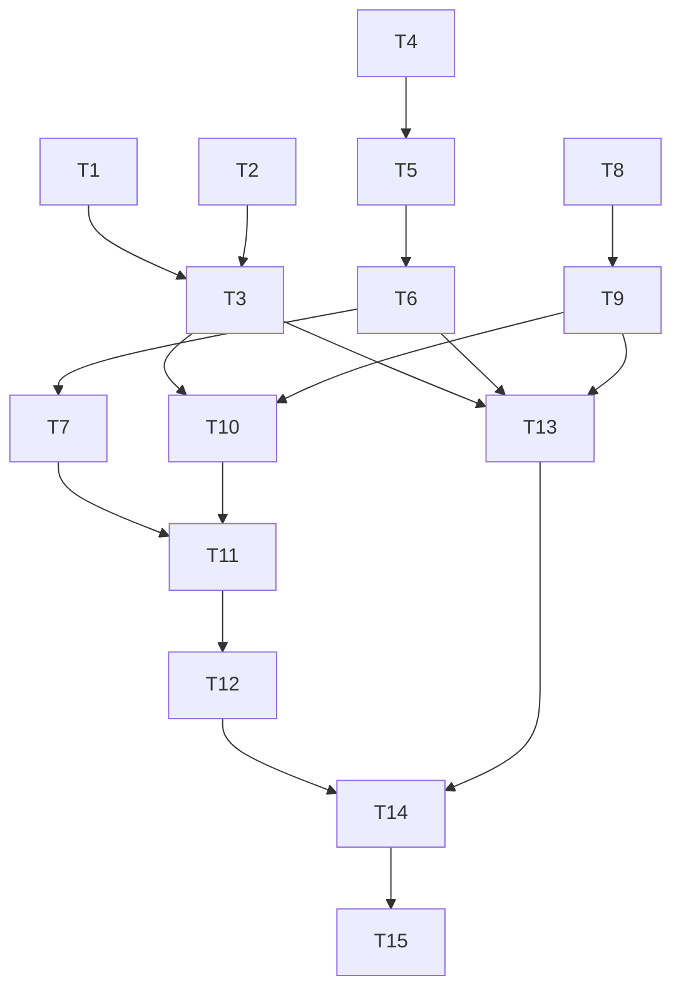

# Study Report: Feature #1 Beat-synced Camera System, Feature #2 Transition Engine v2, Feature #19 Camera Path Presets
Date: 2026-02-15  
Depth: Full  
Method: Structured decomposition, source-quality filtering, cross-verification, hypothesis tracking, self-critique

## Executive summary
For real-time terminal visuals, the safest architecture is:
1. A beat-timing core driven by an audio clock (not wall clock), with confidence-aware beat phase locking.
2. A camera motion layer with two-stage smoothing (speed-adaptive low-pass + critically damped spring), beat impulses, and preset path generators.
3. A transition engine with explicit operators (`hard`, `smooth`, `morph`, `remix`, `luma`, `glitch`), beat-aware scheduler, and continuity guards that suppress accidental jump-cuts.
4. A renderer path optimized around diff-based terminal updates, precomputed lookup tables, and fixed-budget frame loops.

Confidence: High for beat/timing foundations and blend operator model; Medium for morph/remix/glitch perceptual defaults due fewer primary sources specific to terminal art direction.

---

## 1) Sub-questions investigated
1. Which beat tracking algorithms and parameters are practical for low-latency realtime use?
2. How should camera transforms be parameterized to stay musical but not jittery?
3. How should transition types map to operator math that works on terminal cells/colors/glyphs?
4. What scheduling rules avoid unintended perceptual jump-cuts while keeping intentional hard-beat cuts?
5. What implementation plan, test plan, benchmark plan, and failure runbook reduce delivery risk?

---

## 2) Source quality and verification table
| ID | Source | Quality | Recency | Notes |
|---|---|---|---|---|
| S1 | librosa `beat_track` docs | Official docs | Current | Dynamic-programming beat tracking, key params. |
| S2 | Essentia `RhythmExtractor2013` docs | Official docs | Current | Beat positions/confidence, tempo limits, 44.1k requirement. |
| S3 | Essentia `BeatTrackerMultiFeature` docs | Official docs | Current | Multi-onset-feature beat candidate pipeline. |
| S4 | aubio tempo API docs | Official docs | Current | Streaming tempo API + confidence output. |
| S5 | madmom beat docs | Official docs | Current | RNN beat/downbeat activations and references. |
| S6 | mir_eval beat docs | Official docs | Stable | Evaluation metrics + default F-measure window 0.07s. |
| S7 | madmom beat evaluation docs | Official docs | Current | CML/AML metrics + default fmeasure window 0.07s. |
| S8 | FFmpeg filters docs (`blend`, `xfade`) | Official docs | Current | Transition set, custom expr variables, blend modes. |
| S9 | W3C Compositing and Blending Level 1 | Standards spec | Current | Porter-Duff + blend mode formulas. |
| S10 | Porter & Duff 1984 paper landing page | Primary paper index | Foundational | Canonical compositing algebra provenance. |
| S11 | 1€ Filter official page (Casiez et al.) | Official author page | Current | Tuning guidance for `fcmin` and `beta`. |
| S12 | Catmull-Rom parameterization (ScienceDirect abstract/sections) | Publisher page | Stable | Cusp/self-intersection behavior vs parameterization. |
| S13 | Catmull-Rom parameterization (author research page abstract) | Author page | Stable | Confirms centripetal guarantee claim. |
| S14 | Unity Cinemachine blending docs | Official docs | Stable | Practical blend styles (`Cut`, `Ease`, `Linear`, custom curve). |
| S15 | Ratatui rendering under the hood | Official docs | Current | Double buffering + diff flush model. |
| S16 | Ratatui FAQ | Official docs | Current | Reinforces single draw pass + diff behavior. |
| S17 | PortAudio API overview + stream timing | Official docs | Stable | Stream-time synchronization guidance. |
| S18 | PortAudio latency notes | Official docs | Stable | Buffer/latency tradeoff formula. |
| S19 | Web Audio spec/MDN `currentTime` | Standards + docs | Stable | Monotonic audio clock semantics for scheduling. |
| S20 | Eigen quaternion docs (`slerp`) | Official docs | Stable | Constant-speed spherical interpolation. |
| S21 | GLM quaternion docs (`slerp`) | Official docs | Current | Short-path, constant-speed interpolation behavior. |

---

## 3) Verified claims (2+ sources)
1. Beat tracking commonly combines onset evidence with tempo/regularity constraints, not single-threshold peak detection. Verified by S1 and S3.
2. Beat-tracker confidence should be surfaced in API and used for downstream decisions. Verified by S2 and S4.
3. Beat evaluation should include both local hit windows and continuity/metrical metrics, not just F1. Verified by S6 and S7.
4. Standard compositing/blending operators are well-defined and reusable as transition kernels. Verified by S8 and S9.
5. Diff-based double buffering is critical for terminal throughput efficiency. Verified by S15 and S16.
6. Realtime synchronization should anchor to audio stream clocks, not wall clock. Verified by S17 and S19.
7. Quaternion SLERP is appropriate for smooth orientation interpolation at constant angular speed. Verified by S20 and S21.

## 4) Unverified or weakly verified claims (explicit)
1. Universal “jump-cut discomfort thresholds” for terminal-style abstract visuals were not found in strong primary sources; recommended thresholds below are engineering defaults.
2. Morph/remix/glitch perceptual quality ranges are style-dependent and require project-specific tuning.

## 5) Key conflict notes
1. Cinemachine framing treats camera “blend” as transform interpolation, not image dissolve (S14), while FFmpeg `xfade` treats transitions as image-space blending (S8).  
Resolution: support both classes in engine design: camera-state blends and frame-space transitions.

---

## 6) Recommended architecture

## 6.1 Timing core (shared by features #1 and #2)
Use an audio-clock-centric scheduler.

Core state:
- `audio_time_sec` (monotonic stream time)
- `beat_phase` in `[0, 1)`
- `beat_period_sec`
- `beat_confidence` in `[0, 1]`
- `transport_bpm`

Update loop:
1. Read audio timestamp from stream clock (PortAudio-style, WebAudio-style semantics) (S17, S19).
2. Update beat estimator.
3. Run phase-lock correction.
4. Emit quantized events (`bar`, `beat`, `subdiv`) for camera and transition schedulers.

Beat lock (simple PLL form):
```text
e = wrap_to_half_cycle(observed_beat_time - predicted_beat_time)
period = clamp(period + Ki * e, min_period, max_period)
phase  = wrap01(phase + Kp * e / period)
```

Suggested defaults:
- `Kp = 0.15`
- `Ki = 0.02`
- `subdivisions = {1,2,4}`
- `beat_confidence_floor = 0.35`

If confidence < floor:
- Stop hard quantization.
- Fade into tempo-hold mode with gentle easing until confidence recovers.

---

## 6.2 Feature #1: Beat-synced camera system

### Algorithm
Two-stage camera signal conditioning:
1. Beat-driven target generation:
   - Base path from preset function `P(t, params)`.
   - Add beat impulses `I_n` on selected channels (`x/y/z/yaw/pitch/roll/fov`).
2. Jitter/lag control:
   - Stage A: 1€ filter on target channels (S11).
   - Stage B: Critically damped spring on rendered camera state.

Camera channel model:
```text
target_c(t) = base_path_c(t) + Σ impulse_n * env(t - beat_n)
```

Per-channel envelope:
- Attack 10-30 ms
- Decay 80-250 ms
- Sustain optional for wobble styles
- Release 60-160 ms

### Parameterization (terminal-suitable)
- `amplitude_cells`: 0.5-6.0
- `yaw_deg`: 1-18
- `fov_delta_deg`: 0-12
- `mincutoff`: 0.6-2.0
- `beta`: 0.001-0.08
- `spring_omega`: 8-22 rad/s
- `max_vel_cells_per_s`: clamp per channel
- `max_ang_vel_deg_per_s`: clamp rotation

### Intentional hard-beat cuts vs normal motion
- `hard_cut_mode = off | next_beat | every_bar`
- Hard cut only executes when:
  - Beat confidence >= threshold.
  - Event is inside quantization window.
  - Cooldown since last hard cut passed.

Defaults:
- `hard_cut_quant_window_ms = ±30`
- `hard_cut_min_interval_beats = 2`

---

## 6.3 Feature #19: Camera path presets

Use centripetal Catmull-Rom as default interpolation for authored key points to reduce cusp/self-intersection risk (S12, S13).

Preset interface:
```text
sample_preset(preset_id, t, bpm_phase, params) -> {pos, rot, fov, look_at}
```

Orientation interpolation:
- Quaternion SLERP for key rotations (S20, S21).

Initial preset set:
1. `orbit_subject`
2. `dolly_in_out`
3. `crane_arc`
4. `parallax_strafe`
5. `figure8`
6. `spiral_push`
7. `whip_pan`
8. `micro_handheld`

Per-preset params:
- `radius`, `height`, `phase`, `speed_mul`, `swing`, `bank`, `fov_mod`, `beat_reactivity`

Blend between presets:
- Weighted transform blend over `0.25-2.0s`.
- Optional beat-quantized start.

---

## 6.4 Feature #2: Transition engine v2

## 6.4.1 Transition taxonomy
- `hard`: instantaneous state switch (intentional jump cut).
- `smooth`: eased crossfade / transform blend.
- `morph`: cell remap + glyph/color interpolation.
- `remix`: rhythmic slicing/stutter/reorder.
- `luma`: thresholded reveal by luminance mask.
- `glitch`: controlled temporal/spatial corruption + blend.

## 6.4.2 Operator model
Treat transitions as compositing operators over scene/frame abstractions:
```text
Out = T(A, B, p, M, R)
```
- `A`, `B`: outgoing/incoming frames or camera states
- `p`: normalized progress `[0,1]`
- `M`: optional mask/luma field
- `R`: random seed stream (for deterministic replay)

Base blend operators from standard compositing/blending model (S8, S9, S10):
- `normal/source-over`
- `add`
- `screen`
- `multiply`
- `overlay`
- `difference`

Terminal-specific adaptation:
- Blend color in linearized RGB or palette space.
- Blend glyph by coverage rank table (e.g. `' .:-=+*#%@'` density index).

## 6.4.3 Scheduling
Transition event:
```text
{from_scene, to_scene, type, duration_ms, ease, start_mode, beat_quant, params}
```

`start_mode`:
- `immediate`
- `next_beat`
- `next_bar`
- `at_time`

Engine policy:
1. Resolve start time from audio clock.
2. Allocate transition budget.
3. Run continuity guard (unless intentional hard cut).
4. Execute with deterministic seed.

---

## 7) Avoiding perceptual jump-cuts (except intentional hard-beat cuts)

Implement a continuity guard before non-hard transitions:
- Position discontinuity: `Δscreen_pos_cells <= pos_thresh`
- Angular discontinuity: `Δangle_deg <= angle_thresh`
- Velocity discontinuity: `|v_post - v_pre| <= vel_thresh`
- Luma jump: `|mean_luma_B - mean_luma_A| <= luma_thresh`

If violated:
1. Auto-insert micro-bridge (`80-180ms` smooth blend), or
2. Extend transition duration, or
3. Reframe incoming camera via short pre-roll alignment.

Intentional hard-beat cut bypass:
- Allowed only when `style.intentional_cut=true` and beat confidence gate passes.

Practical defaults:
- `pos_thresh = 4 cells`
- `angle_thresh = 12 deg`
- `vel_thresh = tuned per preset`
- `luma_thresh = 0.18 normalized`

Note: these thresholds are engineering baselines, not universal psychovisual constants.

---

## 8) Hypothesis tracking
| Hypothesis | Confidence | Supporting evidence | Contradicting evidence |
|---|---|---|---|
| H1: Audio-clock quantization is mandatory for tight beat sync | High | S17, S19 | None found |
| H2: Multi-feature beat trackers outperform simple onset peak picking for varied music | High | S3, S5 | None found |
| H3: Cusp-safe path interpolation reduces accidental “camera pop” artifacts | Medium-High | S12, S13 | None found |
| H4: Unified compositing operator set simplifies transition implementation | High | S8, S9 | None found |
| H5: Terminal diff-based rendering is enough for 30 FPS at moderate sizes | Medium | S15, S16 | Depends on scene complexity; benchmark required |

---

## 9) Atomic implementation tasks + dependency DAG

## 9.1 Atomic tasks
T1. Add `TimingCore` (audio clock, phase, quantization bus)  
T2. Integrate beat backends (`librosa-like`, `essentia-like`, `aubio-like` adapters)  
T3. Add `BeatPLL` with confidence gating  
T4. Add camera state model (`pos/rot/fov`) and channel envelopes  
T5. Implement 1€ filter + spring smoothing module  
T6. Implement camera preset library and preset parameter schema  
T7. Add quaternion interpolation utilities for orientation  
T8. Implement transition kernel primitives + operator registry  
T9. Implement transition types v2 (`hard/smooth/morph/remix/luma/glitch`)  
T10. Implement beat-aware transition scheduler  
T11. Implement continuity guard and auto-bridge logic  
T12. Add renderer performance counters and budget controller  
T13. Add tests (unit + integration + property + deterministic replay)  
T14. Add benchmark harness and scenario corpus  
T15. Update docs (`README`, in-app help, hotkeys), add QA checklist and runbook

## 9.2 Dependency DAG


---

## 10) Acceptance criteria

## 10.1 Feature #1 Beat-synced camera
1. Beat events emitted with median scheduling error <= 20 ms and p95 <= 40 ms against audio clock.
2. Camera jitter RMS reduced by >= 30% in low-motion segments when 1€ filter enabled.
3. Hard-beat cut triggers only inside quant window and only when confidence gate passes.
4. No NaN/Inf camera state values across 30-minute soak test.

## 10.2 Feature #2 Transition engine v2
1. All six transition types render deterministically with fixed seed.
2. Continuity guard prevents accidental hard visual jumps in non-hard transitions.
3. Transition scheduler supports `immediate`, `next_beat`, `next_bar`, `at_time`.
4. Operator registry supports at least `normal/add/screen/multiply/overlay/difference`.

## 10.3 Feature #19 Camera presets
1. Minimum 8 presets with runtime parameter control.
2. Preset-to-preset blend works with configurable duration and easing.
3. Orientation interpolation follows shortest-path quaternion interpolation.
4. Preset sampling stable for all BPM in supported range (no singular spikes).

## 10.4 Realtime budget
1. At 120x40 terminal: p95 frame time <= 33 ms in normal quality mode.
2. At 200x60 terminal: graceful degradation engages before sustained overruns.
3. No unbounded allocation in frame loop.

---

## 11) Test strategy

## 11.1 Unit tests
1. `beat_quantize(time, grid)` boundary and wrap tests.
2. `BeatPLL` convergence and stability for tempo drift/jitter inputs.
3. 1€ filter parameter behavior (`mincutoff` jitter-lag tradeoff, `beta` speed response).
4. Transition operators preserve bounds and clamp outputs.
5. Preset samplers never emit NaN/Inf; angle unwrap correctness.

## 11.2 Property tests
1. Transition progress monotonicity and endpoint invariants.
2. Deterministic replay under fixed random seed.
3. Scheduler ordering invariants under mixed event sources.

## 11.3 Integration tests
1. Synthetic click track (known BPM) -> beat alignment error budget.
2. Scene switching under `next_beat` and `next_bar` modes.
3. Camera preset blend while transitions overlap.

## 11.4 Golden/snapshot tests
1. Frame hashes for canonical scenes and seeds.
2. Transition signature frames at `p={0, .25, .5, .75, 1}`.

---

## 12) Benchmark plan

Scenarios:
1. Static camera + no transitions (baseline).
2. Beat-reactive camera only.
3. Transition-heavy sequence (every 2 beats).
4. Worst-case glitch/morph stress.

Terminal sizes:
- 80x24, 120x40, 160x50, 200x60

Metrics:
- `frame_time_ms` p50/p95/p99
- dropped frame count
- CPU%
- bytes written per frame
- scheduler lateness vs audio clock
- per-module time slices (`beat`, `camera`, `transition`, `render`)

Acceptance gates:
- Pass/fail thresholds from Section 10.

---

## 13) Failure runbook

## Incident A: Beat drift (>60 ms sustained)
1. Check audio clock source mismatch (wall clock vs stream clock).
2. Inspect `BeatPLL` gain settings and confidence gating.
3. Fallback to tempo-hold mode until confidence recovers.

## Incident B: Camera jitter in low motion
1. Lower `mincutoff` (1€), reduce impulse amplitude.
2. Increase spring damping or reduce `omega`.
3. Validate event burst limiter (avoid stacked impulses).

## Incident C: Missed hard-beat cuts
1. Verify quant window and confidence threshold.
2. Check scheduler backlog and frame overruns.
3. Elevate hard-cut priority over non-critical effects.

## Incident D: Frame budget collapse
1. Enable adaptive quality tier (reduce morph/glitch complexity).
2. Reduce transition overlap count.
3. Tighten dirty-region write path and disable expensive color remaps.

## Incident E: Transition artifacts (glyph/color tearing)
1. Validate operator clamping and glyph LUT bounds.
2. Check color-space conversion path.
3. Verify deterministic seed path and race-free state updates.

---

## 14) Performance optimization paths

Short term:
1. Precompute easing curves and glyph-density LUTs.
2. Avoid per-frame allocations in transition kernels.
3. Batch terminal writes by dirty spans.

Medium term:
1. Incremental region invalidation instead of full-frame diff in hot scenes.
2. SIMD-friendly color/glyph blending kernels.
3. Multi-rate update loop (audio/control at high rate, render at capped rate).

Long term:
1. Quality scaler tied to frame budget.
2. Optional worker thread for expensive morph field precomputation.
3. Scene graph caching for repeated transition motifs.

---

## 15) README/help/hotkeys updates

README additions:
1. New section: “Beat-synced camera and transition engine”.
2. Architecture diagram for TimingCore -> Camera -> Transition -> Renderer.
3. Config reference for beat, smoothing, transition, and preset params.
4. Performance tuning guide per terminal size.
5. Troubleshooting section mapped to runbook incidents.

In-app help updates:
1. Explain `intentional hard cut` mode and confidence gating.
2. Show active preset, BPM lock status, transition queue.
3. Show perf HUD legend (frame time, drops, mode).

Proposed hotkeys:
1. `1..8`: select camera preset
2. `Shift+1..8`: queue preset on next beat
3. `[` / `]`: previous/next transition type
4. `-` / `=`: transition duration down/up
5. `h`: arm hard cut on next beat
6. `b`: toggle beat lock
7. `g`: one-shot glitch burst
8. `m`: toggle morph mode
9. `r`: toggle remix mode
10. `p`: perf HUD
11. `?`: help overlay

---

## 16) Human QA cases
1. Steady metronome 120 BPM: verify cut quantization consistency.
2. Tempo ramp 90->140 BPM: verify PLL lock without chaotic overshoot.
3. Sparse ambient track: verify confidence gating avoids false hard cuts.
4. Dense percussive track: verify no transition starvation.
5. Manual preset switching during active transition.
6. Rapid hotkey bursts: verify deterministic queue behavior.
7. Terminal resize mid-transition.
8. Low-power machine profile: verify adaptive quality fallback.
9. Very slow BPM (<50): verify scheduler stability.
10. Very fast BPM (>200): verify no event pileups.
11. 30-minute soak: verify no drift/leak/crash.
12. Replay exact seed/session: verify visual determinism.

---

## 17) Self-critique and remaining gaps
1. Psychovisual jump-cut thresholds for abstract terminal graphics remain project-specific; recommended thresholds should be tuned with user footage.
2. Morph/remix/glitch quality depends strongly on art direction and palette/glyph sets; include iterative tuning sprints after first integration.
3. If target environment differs from PortAudio/WebAudio style timing APIs, timing abstraction layer may need additional calibration hooks.

---

## 18) Source links
- S1: https://librosa.org/doc/main/generated/librosa.beat.beat_track.html
- S2: https://essentia.upf.edu/reference/std_RhythmExtractor2013.html
- S3: https://essentia.upf.edu/reference/std_BeatTrackerMultiFeature.html
- S4: https://aubio.org/doc/latest/tempo_8h.html
- S5: https://madmom.readthedocs.io/en/v0.14.1/modules/features/beats.html
- S6: https://mir-eval.readthedocs.io/latest/api/beat.html
- S7: https://madmom.readthedocs.io/en/v0.16/modules/evaluation/beats.html
- S8: https://patches.ffmpeg.org/ffmpeg-filters.html
- S9: https://www.w3.org/TR/compositing-1/
- S10: https://keithp.com/~keithp/porterduff/
- S11: https://gery.casiez.net/1euro/
- S12: https://www.sciencedirect.com/science/article/abs/pii/S0010448510001533
- S13: https://www.cemyuksel.com/research/catmullrom_param/
- S14: https://docs.unity.cn/Packages/com.unity.cinemachine%402.2/manual/CinemachineBlending.html
- S15: https://ratatui.rs/concepts/rendering/under-the-hood/
- S16: https://ratatui.rs/faq/
- S17: https://portaudio.com/docs/v19-doxydocs-dev/api_overview.html
- S18: https://www.portaudio.com/docs/latency.html
- S19: https://developer.mozilla.org/en-US/docs/Web/API/BaseAudioContext/currentTime
- S20: https://eigen.tuxfamily.org/dox/classEigen_1_1QuaternionBase.html
- S21: https://glm.g-truc.net/0.9.4/api/a00153.html
