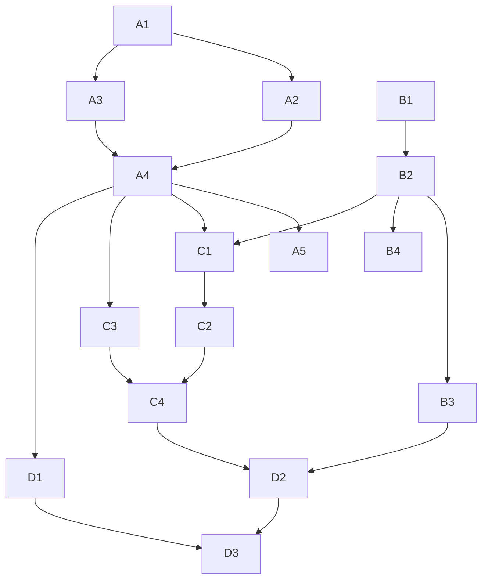

# Study Report: Feature #10 Capability Auto-Probing, Feature #11 Performance Governor, Feature #20 No-HUD Performance Stage Mode
Date: 2026-02-15
Depth: Full

## Executive Summary
For tui-visualizer, the most robust architecture is a capability-first rendering pipeline that actively probes terminal graphics support at runtime, then binds a runtime performance governor and a no-HUD stage mode onto that capability profile. The recommended fallback order is protocol-based (kitty, iTerm2 inline file, SIXEL, text), but selection should be driven by active probe results and in-session failure demotion rather than environment variables alone.

A practical governor should target stable frame pacing over peak FPS, using EMA-smoothed frame-time control with hysteresis, panic handling, and a degradation ladder (effect LOD, dynamic resolution/cell sampling, selective frame skip). Stage mode should remove HUD and high-churn UI surfaces, keep alternate-screen rendering deterministic, and optionally use synchronized output when supported. This combination is likely to produce the best stability/performance tradeoff for local terminals, SSH, and multiplexers.

Confidence: High for protocol detection and governor strategy; Medium for exact synchronized-update escape sequencing portability across all terminals.

## Scope and Sub-Questions
1. What are reliable methods to detect kitty/SIXEL/iTerm2/text capabilities and build a fallback ladder?
2. How should a runtime performance governor choose FPS and dynamic quality controls?
3. How should no-HUD stage mode minimize overhead while preserving stability and terminal hygiene?
4. What implementation DAG, acceptance criteria, tests, benchmarks, and runbook best reduce delivery risk?

## Methodology (Full Study)
- Breadth-first scan of terminal protocol docs, emulator docs, and performance control references.
- Quality filtering to prioritize official documentation and canonical technical references.
- Cross-verification: key architectural claims require 2+ independent sources; single-source claims are flagged.
- Hypothesis tracking with confidence updates.

## Source Quality Log
| ID | Source | Type | Quality | Recency | Notes |
|---|---|---|---|---|---|
| S1 | kitty graphics protocol docs | Official project docs | High | Active | Query semantics and response model for graphics support probing. |
| S2 | xterm ctlseqs | Canonical terminal reference | High | Maintained | DA, alternate screen, SIXEL capability signaling, control sequence behavior. |
| S3 | iTerm2 image protocol | Official product docs | High | Maintained | OSC 1337 inline image transport details. |
| S4 | iTerm2 feature reporting | Official product docs | High | Maintained | Capability flags (FILE/SIXEL/SYNC) and TERM_FEATURES behavior. |
| S5 | foot README | Terminal emulator project docs | High | Active | DA/XTGETTCAP probing order and capability detection patterns. |
| S6 | notcurses man page/FAQ | Library docs | High | Active | Multi-strategy pixel capability detection (TERM, DA, XTGETTCAP). |
| S7 | Android game loop/frame pacing | Platform docs | High | Maintained | Frame pacing pitfalls and cadence stability guidance. |
| S8 | Unity dynamic resolution docs | Engine docs | High | Maintained | Dynamic resolution for maintaining frame rate under GPU pressure. |
| S9 | Unreal dynamic resolution docs | Engine docs | High | Maintained | Frame-time budget-driven resolution scaling and anti-oscillation knobs. |
| S10 | Gaffer on Games (Fix Your Timestep) | Canonical engineering reference | Medium-High | Foundational | Simulation stability and overload behavior under variable dt. |
| S11 | Criterion.rs book | Benchmark framework docs | High | Active | Statistical microbenchmarking for deterministic perf regression checks. |
| S12 | hyperfine README | Benchmark tool docs | High | Active | End-to-end command benchmark patterns for runtime comparisons. |

Rejected/De-prioritized: generic listicles and non-technical summaries that lacked protocol-level details.

## Findings

### Feature #10: Terminal Capability Auto-Probing

#### Capability classes
- `kitty_graphics`: highest fidelity/efficiency where supported.
- `iterm_file`: OSC 1337 inline file transport.
- `sixel`: DEC SIXEL graphics path.
- `text_only`: Unicode blocks/ASCII fallback.

#### Detection strategy (recommended)
Use a 3-phase strategy with strict timeouts:

1. Fast hints (non-authoritative)
- Inspect environment hints for probable terminal family (`TERM`, `TERM_PROGRAM`, known feature vars).
- On iTerm2, parse `TERM_FEATURES` when present (contains feature codes including FILE/SIXEL/SYNC) [S4].

2. Active probes (authoritative)
- kitty probe: send graphics query action (`a=q`) with a unique image id and wait for immediate response [S1].
- SIXEL probe: request primary DA (`CSI c`) and check for SIXEL capability signaling (`Ps=4`) [S2].
- Runtime terminfo probe: use XTGETTCAP and DA sequence ordering to improve correctness through multiplexers/wrappers [S5], [S6].
- iTerm probe: if `TERM_PROGRAM=iTerm.app`, request/report capabilities via documented mechanism and/or rely on `TERM_FEATURES` as feature bitset [S4].

3. Scored selection + session demotion
- Initial preference order: `kitty_graphics` > `iterm_file` > `sixel` > `text_only`.
- If selected renderer fails repeatedly (timeout/decode/error burst), demote one rung for the session and continue without crash.
- Re-probe on terminal reattach, multiplexer boundary changes, or manual “re-detect” action.

#### Robust fallback ladder (behavioral)
- Startup: probe all candidates in parallel with per-probe timeout budget.
- Runtime: maintain a renderer health score.
- On soft failure: retry current path once.
- On hard failure: demote to next renderer, persist demotion for session.
- On repeated global failures: lock `text_only` safe mode and surface a single diagnostic hint.

#### Why this approach
Environment-only detection is fast but brittle under SSH/tmux/screen. DA + XTGETTCAP + protocol-specific query gives better correctness in heterogeneous paths [S5], [S6], [S1], [S2].

---

### Feature #11: Runtime Performance Governor

#### Objectives
- Keep frame pacing stable at target FPS tiers.
- Minimize visible stutter before sacrificing fidelity.
- Avoid oscillation (“thrash”) between quality states.

#### Target tiers and budgets
- `High`: 60 FPS target, 16.67 ms budget.
- `Balanced`: 30 FPS target, 33.33 ms budget.
- `Safe`: 20 FPS target, 50.00 ms budget.

#### Control inputs
- `frame_ms_ema`: EMA-smoothed total frame time.
- `render_ms_ema`: render pass time.
- `encode_ms_ema`: image/protocol encode + write time.
- `drop_rate`: skipped-present ratio.
- `io_backpressure`: write latency / partial-write pressure.

#### Degradation ladder (least disruptive first)
1. Effect LOD reduction (particle density, blur, gradients, shadow passes).
2. Dynamic resolution/cell sampling scale down.
3. Selective update throttling (HUD/secondary layers every N frames).
4. Global frame-skip cadence (render at target cadence, process input each tick).
5. Lower FPS tier.

Upgrade path is inverse, with stricter hysteresis.

#### Anti-oscillation policy
- Degrade only if `frame_ms_ema > budget * 1.10` for `N` consecutive frames.
- Upgrade only if `frame_ms_ema < budget * 0.75` for `M` consecutive frames (`M > N`).
- Minimum dwell time per governor state.

This matches established dynamic-resolution control guidance where frame-time budget and change-threshold windows prevent unstable quality bouncing [S9], [S8].

#### Overload protection (“panic”)
If frame time exceeds 2x budget for a short burst:
- Immediately disable high-cost effects and lock current tier for cooldown window.
- Clamp simulation steps and avoid unbounded catch-up loops.

Rationale is consistent with frame pacing and timestep stability guidance: overload without guardrails causes jitter or spiral behavior [S7], [S10].

---

### Feature #20: No-HUD Performance Stage Mode

#### Design intent
A deterministic low-overhead mode for demos/recordings/benchmark runs where stability is prioritized above observability UI.

#### Stage mode policy
- Disable HUD overlays, diagnostics panes, animated chrome, and non-critical text churn.
- Use alternate screen buffer for isolated full-screen draw lifecycle [S2].
- Keep input processing active, but reduce non-essential redraw triggers.
- Persist telemetry to in-memory ring buffer (deferred flush on exit) rather than live HUD drawing.
- If synchronized output capability is advertised, batch/commit updates in synchronized mode [S4], [S5].
- Freeze layout topology in stage mode (no auto-reflow unless resize event).

#### Stability guardrails
- RAII/guarded terminal state restoration on panic/crash/ctrl-c (cursor, alt-screen, modes).
- Stage mode enters/exits idempotently.
- Hard fallback to text renderer if graphics path health drops below threshold.

#### Expected impact
- Lower CPU and write-amplification from reduced overlay churn.
- Lower jitter risk from deterministic redraw cadence.
- Better user trust from predictable failure behavior and clean terminal restoration.

## Atomic Tasks and Dependency DAG

### Atomic task list
- A1: Implement capability model + renderer registry (`kitty`, `iterm`, `sixel`, `text`).
- A2: Implement passive environment hint parser.
- A3: Implement active probe engine (kitty query, DA parse, XTGETTCAP path, iTerm features).
- A4: Implement renderer selector with scoring + demotion cache.
- A5: Add probe diagnostics command and debug output.
- B1: Add frame timing instrumentation and rolling metrics store.
- B2: Implement governor state machine (tiers, hysteresis, dwell timers).
- B3: Wire degradation hooks (LOD, resolution scale, selective update cadence).
- B4: Add overload panic mode and cooldown behavior.
- C1: Add stage mode state + hotkey/command plumbing.
- C2: Implement no-HUD render pipeline and topology freeze.
- C3: Implement synchronized output adapter (capability-gated).
- C4: Implement robust enter/exit restoration guards.
- D1: Build protocol probe test harness + transcript fixtures.
- D2: Build perf benchmark suites (micro + e2e) and thresholds.
- D3: Write runbook and docs/help updates.

### Dependency DAG

## Acceptance Criteria

### Feature #10 (auto-probing)
- Correctly identifies and selects renderer across at least: kitty, iTerm2, SIXEL-capable xterm path, and text-only terminal.
- Probe completion within startup budget (configurable; default <= 150 ms total).
- On renderer failure burst, auto-demotes without crash and without terminal corruption.
- “Re-detect” action works after tmux/SSH boundary changes.

### Feature #11 (governor)
- Maintains selected FPS tier within acceptable jitter envelope under normal load.
- Under induced load, quality degrades stepwise before frame collapse.
- No rapid oscillation between states in steady workloads.
- Panic mode triggers and recovers deterministically.

### Feature #20 (stage mode)
- Stage mode reduces frame-time variance relative to normal mode in same workload.
- Terminal state always restored correctly on normal exit and interruption.
- HUD and non-essential redraw traffic are absent in stage mode.
- Capability fallbacks still function while in stage mode.

## Test Suites, Benchmarks, and Failure Runbook

### Test suites
1. Unit tests
- DA parser (`CSI c`) including SIXEL signaling cases.
- kitty query response parser and timeout handling.
- iTerm feature-code parser (`TERM_FEATURES`/capability reply).
- Governor transitions (degrade/upgrade/panic/dwell rules).

2. Integration tests (PTY-based)
- Replay transcript fixtures for kitty/SIXEL/iTerm/text scenarios.
- Multiplexer scenarios (tmux/screen-like wrappers) validating re-probe and demotion behavior.
- Stage mode enter/exit under forced interruption.

3. Performance tests
- Microbench (Criterion): parsers, diffing, layout, encode paths [S11].
- End-to-end benchmark (hyperfine): startup probe time, steady-state FPS modes, stage mode delta [S12].

### Benchmark matrix
- Environments: local terminal, SSH remote, tmux local, tmux over SSH.
- Profiles: default mode vs stage mode, each renderer path.
- Loads: idle, medium animation, worst-case burst.

### Failure runbook
1. Symptom: startup stalls or long probe time
- Check probe timeout logs per protocol.
- Verify probe parallelism and total timeout cap.
- Force `text_only` safe mode and continue session.

2. Symptom: frequent renderer demotion
- Inspect renderer health counters (timeouts, parse errors, write failures).
- Disable highest-cost renderer for session and capture transcript.
- Re-run probe in debug mode to isolate protocol mismatch.

3. Symptom: governor oscillation
- Inspect EMA, hysteresis thresholds, dwell timers.
- Increase upgrade hysteresis and minimum dwell.
- Validate load source (layout churn vs encode bottleneck).

4. Symptom: stage mode still janky
- Confirm HUD path truly disabled.
- Confirm synchronized output capability gate is correct.
- Compare frame variance between stage and normal mode; inspect write amplification.

5. Symptom: terminal left corrupted on crash
- Verify exit guard always runs (panic hook/signal path).
- Add restoration idempotency tests.

## Perf Metrics and Optimization Paths

### Metrics to collect
- `frame_ms_p50/p95/p99`
- `render_ms`, `encode_ms`, `io_ms`
- `fps_actual` and `fps_drop_rate`
- `bytes_written_per_sec`
- `renderer_demotion_count`
- `stage_mode_variance_delta`

### Optimization path (ordered)
1. Reduce draw/update area (dirty-rect discipline, avoid full-frame redraws).
2. Reduce protocol payload (resolution scale, effect simplification).
3. Improve batching and synchronized commit where available.
4. Minimize allocations in hot path (reuse buffers/arena).
5. Separate input cadence from render cadence to preserve responsiveness under low FPS.

## README / Help / Hotkeys / Human QA Updates

### README updates
- Add “Renderer Capability Auto-Probing” section:
  - Detection order, probes, fallback behavior, env overrides.
- Add “Performance Governor” section:
  - FPS tiers, degrade ladder, panic behavior, tuning knobs.
- Add “Stage Mode” section:
  - Purpose, behavior changes, stability guarantees.

### Help screen updates
- Show active renderer (`kitty`/`iterm`/`sixel`/`text`).
- Show governor tier and current quality level.
- Show stage mode status and one-line behavior summary.

### Proposed hotkeys
- `F10`: force capability re-probe.
- `F11`: cycle governor tier (`High -> Balanced -> Safe`).
- `F12`: toggle stage mode.
- `Shift+F12`: emergency safe mode (`text_only` + minimal effects).

### Human QA checklist
1. Validate renderer selection in each target terminal.
2. Induce load and verify smooth degradation (not collapse).
3. Toggle stage mode during active animation and ensure no terminal corruption.
4. Interrupt process (`Ctrl-C`) in stage mode and confirm restoration.
5. Validate help text/hotkeys match runtime behavior.

## Hypothesis Tracking
| Hypothesis | Confidence | Supporting Evidence | Contradicting Evidence |
|---|---|---|---|
| H1: Active protocol probing + DA/XTGETTCAP beats env-only detection for correctness | High | S1, S2, S5, S6 | None material |
| H2: Budget-based dynamic governor with hysteresis yields best stability | High | S8, S9, S7 | None material |
| H3: No-HUD stage mode + synchronized/batched output materially lowers jitter | Medium-High | S4, S5, S2 | Cross-terminal sync behavior details vary |

## Verification Status

### Verified (2+ independent sources)
- Dynamic resolution should be tied to frame-time budget and anti-oscillation controls, not immediate per-frame toggles [S8], [S9].
- Stable frame pacing and overload safeguards are critical; unconstrained variable timing can destabilize simulation/render cadence [S7], [S10].
- Runtime terminal capability detection benefits from DA/XTGETTCAP/protocol-level probing rather than env-only checks [S5], [S6], [S2].
- Synchronized output can be capability-gated via advertised features and used opportunistically [S4], [S5].
- Combining microbenchmark and end-to-end benchmark tools provides better regression coverage [S11], [S12].

### Unverified / single-source-sensitive
- Exact kitty query payload/edge-case behavior beyond documented happy path depends primarily on S1 and should be validated against real terminals.
- Alternate-screen behavior assumptions rely heavily on xterm semantics (S2); compatibility with all emulators should be tested empirically.

### Conflicts
- No hard conflicts found in core architecture recommendations.
- Minor portability ambiguity remains around synchronized update sequence nuances across emulator families; resolved by capability-gated implementation and fallback.

## Limitations and Gaps
- No direct empirical benchmark was run in this study; recommendations are design-level, source-grounded.
- Terminal behavior under nested multiplexers can diverge in practice; transcript-based integration tests are mandatory before rollout.
- Stage mode “best” default tier may depend on real-world content mix (CPU-bound layout vs I/O-bound transport).

## Implementation Notes (Pragmatic Defaults)
- Default startup probe budget: 150 ms total, with per-probe timeout 30–50 ms.
- Default governor tier: `Balanced`.
- Default stage mode: force HUD off + freeze layout + keep input responsive.
- Default failure policy: demote renderer quickly, never crash, always restore terminal state.

## Sources
- [S1] kitty graphics protocol docs: https://sw.kovidgoyal.net/kitty/graphics-protocol/
- [S2] xterm control sequences: https://invisible-island.net/xterm/ctlseqs/ctlseqs.html
- [S3] iTerm2 images protocol: https://iterm2.com/documentation-images.html
- [S4] iTerm2 feature reporting: https://iterm2.com/feature-reporting/
- [S5] foot README (terminal capability detection notes): https://github.com/yonasBSD/foot
- [S6] notcurses man page/FAQ: https://notcurses.com/notcurses.3.html and https://notcurses.com/faq/
- [S7] Android game loops and frame pacing: https://developer.android.com/games/develop/gameloops
- [S8] Unity dynamic resolution introduction: https://docs.unity3d.com/Manual/DynamicResolution-introduction.html
- [S9] Unreal Engine dynamic resolution: https://dev.epicgames.com/documentation/en-us/unreal-engine/dynamic-resolution-in-unreal-engine
- [S10] Fix Your Timestep: https://gafferongames.com/post/fix_your_timestep/
- [S11] Criterion.rs book: https://bheisler.github.io/criterion.rs/book/
- [S12] hyperfine: https://github.com/sharkdp/hyperfine
