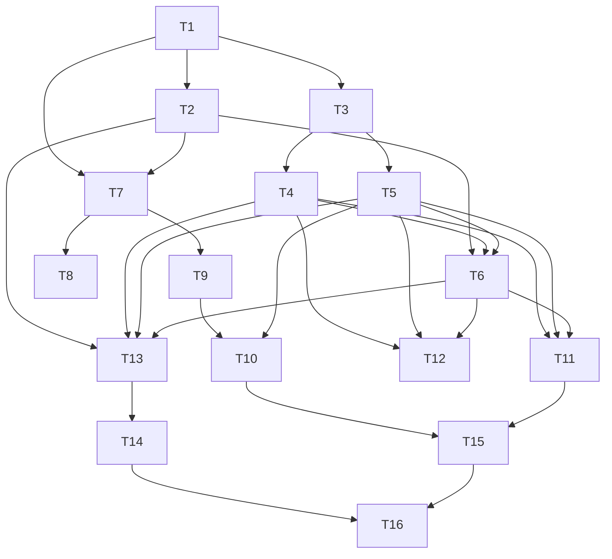

# Study: Feature #3 Preset Graph Mode + Feature #17 Theme Packs
Date: 2026-02-15
Depth: Full

## Executive Summary
Feature #3 (preset graph mode) and Feature #17 (theme packs) should be implemented as one cohesive system: graph-defined presets become the portable unit inside versioned theme packs, and packs provide curated playlists plus metadata that drive auto-switching and transitions.

Recommended architecture:
1. Add a graph preset schema with three explicit stages: `base -> layers -> post_chain`.
2. Add a typed modulation router (`audio/time/state sources -> parameter targets`) compiled once per preset.
3. Add hard safety constraints at both load time (schema + semantic checks) and runtime (clamps + budget guards + fallback).
4. Introduce a versioned theme-pack format (`.tvpack` + unpacked directory), with manifest, presets, playlists, assets, and checksums.
5. Roll out behind a feature flag, with deterministic fixtures and performance gates tied to existing benchmarking workflow.

Confidence: High for feasibility, Medium for initial tuning defaults (modulation depth and transition heuristics need subjective iteration).

## Scope and Sub-Questions
1. How should graph composition be represented to support current presets and future growth?
2. How should modulation routing be modeled to remain deterministic, fast, and safe?
3. What should a theme pack contain (metadata, playlists, presets, versioning, distribution)?
4. What is the minimum atomic implementation plan and dependency DAG?
5. What acceptance criteria and test/runbook gates should block release?
6. What are the performance risks and caching opportunities?
7. Which docs/help/hotkeys updates are required for usability?
8. Which human QA scenarios best reveal failures on subtle vs energetic music?

## Current Baseline (Repo-Verified)

### Runtime and control model
- Runtime pipeline already supports audio features, auto-switch heuristics, transitions, and renderer/engine separation.
- `PresetEngine` already tracks playlist, switch mode, transition mode/kind/duration, and transition override.
- Transition system already supports 14 transition kinds and heuristics based on onset/beat/centroid/flatness.

### Preset model today
- Presets are currently code-defined `FieldPreset` instances with:
  - algorithm (`Algo`)
  - palette (`Palette`)
  - feedback settings (`Feedback`)
- Rendering path already behaves like an implicit graph:
  - base field synthesis
  - optional feedback reuse
  - color/palette mapping
  - transition blending

### Existing safety and playlist constraints
- `RenderCtx` already includes `safe: bool`; safe mode reduces beat pulse intensity in preset rendering.
- Playlists are persisted as versioned text (`# tui_visualizer playlists v1`) and include immutable `All Presets` at index `0`.

Inference: Feature #3 should formalize the implicit pipeline into a declarative graph model, and Feature #17 should supersede text-only playlist persistence with richer pack metadata while preserving backward compatibility.

## Cross-Verified External Findings

### Verified claims (2+ sources)
1. Milkdrop-style systems treat presets as parameter/equation programs and rely heavily on staged processing + variables.
- Source A: Milkdrop preset authoring guide (per-frame/per-vertex equations, variables, transitions).
- Source B: Webamp Milkdrop docs (Butterchurn cycling + transition behavior).

2. “Use previous visual state as transition input” is a core continuity mechanism.
- Source A: Webamp Milkdrop docs explicitly states previous preset image feeds next preset during transitions.
- Source B: Existing Brotviz preset pipeline already uses previous frame feedback and transition modes, so the pattern maps directly.

3. Preset ecosystems scale with pack-level curation and grouping.
- Source A: projectM preset pack repo notes large curated preset pack grouped by folders/themes.
- Source B: butterchurn-presets repo exposes preset-pack artifacts (`base.js`, `all.js`, `presetPackMeta.js`), validating pack metadata/distribution as a practical unit.

### Additional standards grounding
- Semantic versioning policy: SemVer 2.0.0 rules for MAJOR/MINOR/PATCH and immutable released versions.
- Manifest validation model: JSON Schema 2020-12 split (Core + Validation), with meta-schema support.
- License identifier normalization: SPDX license list identifiers.

## Proposed Data Model

### 1) Preset graph composition (`base/layer/post_chain`)

```rust
#[derive(Clone, Debug, Serialize, Deserialize)]
pub struct GraphPreset {
    pub id: String,                    // stable key, e.g. "fractal.infinite_dive"
    pub name: String,
    pub schema_version: String,        // e.g. "1.0"
    pub graph_version: String,         // semver for this preset artifact
    pub tags: Vec<String>,
    pub energy_profile: EnergyProfile, // Calm | Balanced | Energetic

    pub base: BaseNode,
    pub layers: Vec<LayerNode>,        // ordered compositing stack
    pub post_chain: Vec<PostNode>,     // ordered full-frame effects

    pub modulation_routes: Vec<ModRoute>,
    pub safety: SafetyProfile,

    pub transition_hints: TransitionHints,
}

pub enum BaseNode {
    Fractal(FractalParams),
    Field(FieldParams),
    Attractor(AttractorParams),
    Noise(NoiseParams),
    FeedbackOnly(FeedbackParams),
}

pub struct LayerNode {
    pub id: String,
    pub kind: LayerKind,
    pub blend: BlendMode,
    pub opacity: ParamRef,
    pub mask: Option<MaskRef>,
    pub enabled_if: Option<GateExpr>,
    pub params: ParamMap,
}

pub struct PostNode {
    pub id: String,
    pub kind: PostKind,
    pub bypass: bool,
    pub params: ParamMap,
}
```

Composition order per frame:
1. Render `base` into working buffer.
2. Apply `layers` in declared order.
3. Apply `post_chain` in declared order.
4. Apply transition blend (if switching) with existing transition subsystem.

Design rule:
- `base` must be exactly one node.
- `layers` and `post_chain` may be empty.
- Side-effect order is deterministic and declaration-ordered.

### 2) Modulation routing model

```rust
pub enum ModSource {
    Rms,
    Onset,
    Beat,
    BeatStrength,
    Band(u8),          // 0..7
    Centroid,
    Flatness,
    Time,
    BeatPulse,
    FractalZoomDrive,
    Const(f32),
}

pub struct ModRoute {
    pub id: String,
    pub source: ModSource,
    pub target: ParamPath,             // e.g. "layers[2].params.warp_amp"
    pub depth: f32,                    // signed
    pub curve: ModCurve,               // Linear | Exp | Log | SmoothStep
    pub smoothing_ms: u16,
    pub clamp: (f32, f32),
    pub priority: i16,                 // lower first
    pub enabled_if: Option<GateExpr>,
}
```

Runtime compilation:
- Parse routes once into a per-target dispatch table.
- Sort by `(priority, route_id)` for deterministic accumulation.
- Precompute curve lookup tables where useful.

Runtime evaluation:
- Resolve all source values from `RenderCtx` and engine state.
- Apply route transform and clamp.
- Aggregate by target with defined combine op (`sum`, then target-level clamp).

### 3) Safety constraints (load-time + runtime)

```rust
pub struct SafetyProfile {
    pub max_feedback: f32,             // clamp recursive energy
    pub max_warp_amp: f32,
    pub max_zoom_delta_per_frame: f32,
    pub max_post_passes: u8,
    pub max_layer_count: u8,
    pub max_mod_routes: u16,
    pub strobe_guard_hz: f32,
    pub luma_delta_guard: f32,
    pub frame_budget_ms: f32,
    pub safe_fallback_preset_id: String,
}
```

Load-time rejection criteria:
- Unknown node/parameter identifiers.
- Duplicate IDs.
- Out-of-range static parameters.
- Invalid route targets.
- Route count or pass count above safety profile.

Runtime guardrails:
- Final parameter clamps after modulation.
- Brightness delta limiter per frame (anti-flash).
- Transition hardening under `safe=true`.
- Frame budget watchdog: auto-reduce quality/scale, then fallback preset.

## Theme Pack Structure and Metadata

### Pack layout

```text
theme-pack/
  pack.toml
  schema/
    pack.schema.json
    graph.schema.json
  presets/
    *.graph.toml
  playlists/
    *.playlist.toml
  palettes/
    *.palette.toml
  assets/
    thumbnails/
    previews/
  checksums.sha256
  SIGNATURE.ed25519   # optional
```

### Manifest (`pack.toml`) draft

```toml
id = "tv.neon-hypnosis"
display_name = "Neon Hypnosis"
pack_version = "1.2.0"
pack_api = "1.0"
min_app_version = "0.9.0"
license = "MIT"            # SPDX identifier
authors = ["A. Visual"]
description = "Fractal-forward set with smooth transitions"
tags = ["fractal", "psychedelic", "smooth"]
default_playlist = "main"
default_preset = "fractal.infinite_dive"

[preset_compat]
requires_transition_kinds = ["Fade", "Zoom", "Morph", "Datamosh"]
requires_audio_features = ["rms", "onset", "beat_strength", "bands", "centroid", "flatness"]
```

### Preset metadata
Required:
- `id`, `name`, `graph_version`, `schema_version`, `energy_profile`, `tags`, `transition_hints`.

Recommended:
- `bpm_hint_range`, `mood`, `author`, `description`, `preview_seed`, `safe_variant_ref`.

### Playlist metadata

```toml
id = "main"
name = "Main Set"
description = "Balanced flow from ambient to peak"
preset_ids = ["fractal.infinite_dive", "warp.candy_melt", "attractor.knots"]
ordering = "curated" # curated | shuffled
auto_switch = "adaptive" # manual | beat | energy | time | adaptive
seconds_per_switch = 18.0
```

### Packaging and versioning policy
- Distribution format:
  - unpacked directory for development
  - `.tvpack` (zip) for distribution
- Versioning:
  - SemVer for `pack_version` and each `graph_version`
  - `pack_api` for schema/runtime compatibility contract
- Integrity:
  - SHA-256 file list (`checksums.sha256`)
  - Optional detached signature
- Backward compatibility:
  - Keep legacy `playlists.txt` import path; convert into generated local pack (`local.migrated.v1`).

## Atomic Tasks + Dependency DAG

### Atomic tasks
T1. Finalize graph + pack schemas (`graph.schema.json`, `pack.schema.json`, `playlist.schema.json`).
T2. Build schema validators and semantic validators.
T3. Add `GraphPreset` parser and internal IR compiler.
T4. Implement base/layer/post execution pipeline in CPU engine.
T5. Implement modulation routing compiler + evaluator.
T6. Add safety guardrails (load-time and runtime).
T7. Add theme-pack loader (directory + `.tvpack`) and checksum verifier.
T8. Add pack cache index (`~/.config/tui_visualizer/packs/index-v1.json`).
T9. Integrate pack playlists with existing playlist manager + migration from `playlists.txt`.
T10. Add UI controls and hotkeys for pack/preset graph operations.
T11. Integrate graph presets into transition and auto-switch heuristics.
T12. Add telemetry counters for graph cost, route count, safety interventions.
T13. Implement test suites (schema, parser, runtime determinism, safety, migration).
T14. Add benchmark extensions and CI smoke thresholds for graph mode.
T15. Update docs/help/HUD/README/USAGE/ARCHITECTURE/testing docs.
T16. Run human QA matrix (subtle vs energetic tracks) and tune defaults.

### Dependency DAG



## Acceptance Criteria

### Feature #3: Preset graph mode
1. Graph presets can express current `FieldPreset` equivalence class:
- At least 10 existing presets are ported with visually comparable behavior.

2. Composition model correctness:
- Exactly one base node.
- Ordered layer and post execution verified by golden tests.

3. Modulation routing correctness:
- Routes resolve deterministically for same seed/audio fixture.
- Target clamps always respected.
- Disabled routes have zero effect.

4. Safety behavior:
- `safe=true` enforces stronger modulation caps and anti-flash limiter.
- Invalid graph files are rejected with actionable diagnostics.
- Budget overruns trigger graceful quality degradation then fallback preset.

### Feature #17: Theme packs
1. Pack loading:
- App discovers both unpacked pack directories and `.tvpack` archives.
- Invalid signatures/checksums are reported and pack is quarantined.

2. Metadata and playlist UX:
- Pack name/version/author visible in UI/HUD/help.
- Pack playlists selectable in playlist manager.
- Legacy playlist file imports without data loss.

3. Compatibility:
- Pack API mismatch results in clear rejection message.
- Compatible packs remain stable across app patch/minor upgrades.

## Test Strategy and Runbook

### Test strategy

Unit tests:
- Schema parse/validation (good + malformed samples).
- Route compiler determinism and clamp behavior.
- Safety guard functions (flash limiter, warp/zoom caps).

Property tests:
- Randomized modulation graphs with bounded outputs.
- No panics on adversarial pack inputs.

Integration tests:
- Load pack -> select playlist -> render frames -> switch presets.
- Migration `playlists.txt -> local pack`.
- Safe-mode behavior under high onset/beat fixtures.

Golden/render tests:
- Deterministic fixed-seed frames for representative graphs.
- Transition snapshots across `Fade`, `Morph`, `Datamosh`, `Zoom`.

Performance tests:
- Extend benchmark to include graph presets by complexity tier:
  - Tier A: base only
  - Tier B: base + 3 layers
  - Tier C: base + 6 layers + 4 post + 24 routes
- Gate on frame time percentile and black-frame smoke checks.

### Runbook (implementation and verification)
1. Validate schemas against sample packs.
2. Load sample pack and verify diagnostics for intentionally bad pack.
3. Run existing test suite plus graph/pack test targets.
4. Run benchmark in CPU and Metal modes with graph tiers.
5. Play deterministic fixture audio and inspect HUD latency/frame counters.
6. Execute human QA matrix (below) and capture tuning notes.
7. Freeze defaults and regenerate docs/help text.

## Performance Implications and Caching Plan

### Expected cost drivers
- Per-route modulation evaluation (`O(routes)` each frame).
- Layer/post pass count and framebuffer bandwidth.
- Repeated parsing/validation if pack cache absent.

### Caching and optimization plan
1. Compile cache:
- Parse + validate once at load.
- Compile graph to internal IR with resolved parameter offsets.

2. Route cache:
- Pre-sort route dispatch vectors per target.
- Optional LUT for nonlinear curves.

3. Buffer reuse:
- Reuse existing `front/back/tmp_a/tmp_b` strategy; avoid per-frame allocations.

4. Pack index cache:
- Persist pack metadata hash + file mtimes.
- Revalidate only changed files on startup.

5. Warm-start presets:
- Precompute transition hint table and energy profile index for fast auto-switch selection.

6. Adaptive degradation:
- If frame budget exceeded: reduce quality, then scale, then disable expensive post nodes before fallback.

## README / Help / Hotkeys / Docs Updates

### README.md
- Add sections:
  - “Preset Graph Mode”
  - “Theme Packs (.tvpack)”
  - “Pack Safety and Compatibility”

### docs/USAGE.md
- Add flags:
  - `--graph-mode on|off|auto`
  - `--pack-dir <path>`
  - `--pack <id-or-path>`
  - `--pack-safe true|false`
  - `--pack-verify strict|warn|off`

### docs/ARCHITECTURE.md
- Add module boundaries:
  - graph parser/compiler
  - modulation router
  - pack loader/cache
  - migration adapter

### docs/testing.md
- Add graph-specific benchmark tiers, schema tests, migration tests, and safety stress tests.

### In-app help / HUD text
Proposed hotkeys (no existing conflicts):
- `g`: toggle graph preset mode
- `y` / `Y`: next / previous theme pack
- `l`: lock/unlock pack auto-switching
- `ctrl+r`: reload packs

HUD additions:
- `Pack: <name>@<version>`
- `Graph: <preset_id> | Layers: N | Routes: N | Safety: on/off`

## Human QA Cases (Subtle Music vs Energetic Tracks)

### A) Subtle / ambient / low-onset material
Goal: verify stability, smoothness, and non-jitter behavior.

Cases:
1. Fixture smooth section (existing deterministic test audio).
2. Ambient track with low percussion and long pads.
3. Spoken-word/podcast segment (low beat periodicity).

Checkpoints:
- Auto mode favors smooth transitions (`Fade/Zoom/Morph`) over hard cuts.
- Modulation depth remains readable, not flat and not twitchy.
- No brightness pumping or rapid palette flicker.

### B) Energetic / transient-heavy material
Goal: verify punch response without unsafe strobing or perf collapse.

Cases:
1. Fixture dense transient section.
2. High-BPM EDM with strong kicks and hats.
3. Drum-and-bass track with sharp treble transients.

Checkpoints:
- Transition picks become punchier (`Cut/Datamosh/Wipe`) but stay controlled in safe mode.
- Route clamps prevent overshoot artifacts.
- Frame time and latency remain inside acceptable bounds.

### C) Mixed dynamics
Goal: verify adaptive behavior across section changes.

Cases:
1. Tracks with quiet intro -> energetic drop -> quiet outro.

Checkpoints:
- Theme/preset progression feels intentional.
- No abrupt quality collapse during drops.
- Recovery after high-energy sections is smooth.

## Hypothesis Tracking

| Hypothesis | Confidence | Supporting Evidence | Contradicting Evidence |
|---|---|---|---|
| H1: Declarative graph presets can replace code-only presets without losing expressiveness for v1 scope | High | Current pipeline already stage-like; Milkdrop authoring model supports staged parameter logic | Extremely custom algorithm code paths may still require escape hatches |
| H2: Theme packs should be the primary distribution and curation unit | High | projectM preset packs + butterchurn-presets packaging patterns | Adds manifest/schema overhead for small local-only workflows |
| H3: Runtime safety guardrails are required for user-imported packs | High | Existing safe mode intent + high-variance modulation/transitions + untrusted pack inputs | Slight creative constraint for advanced packs |
| H4: Performance risk is manageable with compile-time graph IR and route caching | Medium-High | Existing buffer reuse + deterministic benchmark harness | Worst-case pack complexity may exceed baseline frame budgets on CPU path |

## Self-Critique and Gaps
1. Could not directly use the projectM equations reference page due crawler URL safety restrictions; mitigated with Milkdrop authoring docs + projectM preset-pack evidence.
2. Suggested hotkeys are conflict-free in current map, but need final UX decision if future keymap expansion is planned.
3. Default modulation depth/smoothing constants should be tuned with real listening sessions; proposed values are a safe starting point, not final art direction.

## Sources

### Internal (repo)
- README: ../README.md
- Architecture: ../docs/ARCHITECTURE.md
- Usage: ../docs/USAGE.md
- Testing: ../docs/testing.md
- Runtime + playlist persistence:
  - ../src/app.rs
  - ../src/config.rs
  - ../src/visual/mod.rs
  - ../src/visual/presets.rs
- Prior research:
  - ../research/research-terminal-audioreactive-tui-2026-02-14.md
  - ../research/research-terminal-rendering-methods-2026-02-15.md
  - ../research/research-psychedelic-presets-transitions-2026-02-14.md

### External
- Milkdrop preset authoring guide: https://www.geisswerks.com/hosted/milkdrop2/milkdrop_preset_authoring.html
- Webamp Milkdrop docs: https://docs.webamp.org/docs/features/mikdrop/
- Webamp bundle/preset-pack notes (Butterchurn presets packaging): https://docs.webamp.org/docs/guides/bundle-size/
- projectM curated preset pack repository: https://github.com/projectM-visualizer/presets-cream-of-the-crop
- butterchurn-presets repository: https://github.com/jberg/butterchurn-presets
- Semantic Versioning 2.0.0: https://semver.org/
- JSON Schema specification (2020-12): https://json-schema.org/specification
- SPDX License List: https://spdx.org/licenses/
