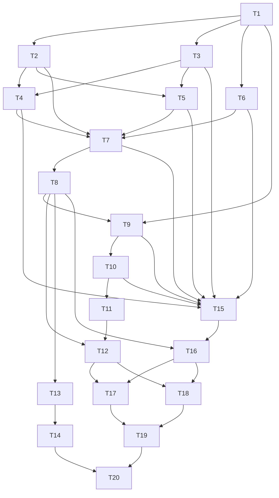

# Study Report: Feature #14 Audio-Reactive Typography Layer
Date: 2026-02-15
Depth: Full

## Executive Summary
For Feature #14, the most reliable approach in a terminal visualizer is a constraint-first typography layer: treat text as a timed overlay system with strict readability budgets, then add audio reactivity only inside those budgets. The recommended architecture is a three-layer model:
1. waveform text strip (low semantic value, high motion),
2. metadata captions (high semantic value, medium motion),
3. lyric-style timed overlays (highest semantic value, lowest allowed motion).

This aligns with current Brotviz architecture (audio feature extraction -> render -> HUD/overlay composition) and can be implemented without destabilizing frame pacing by using incremental layout, grapheme-aware wrapping, width-aware clipping, and tiered degradation.

Confidence: High for typography constraints and cue layout rules; Medium-High for exact motion/readability tuning defaults (requires repo-specific calibration).

## Scope and Sub-Questions
1. Which terminal-safe typography algorithms fit Brotviz’s renderer model?
2. How should audio features map to typographic behavior without harming readability?
3. Which anti-clutter and accessibility rules are non-negotiable?
4. What atomic implementation plan, tests, runbook, and docs/hotkey updates de-risk rollout?

## Methodology (Full Study)
- Breadth-first research across standards and primary docs (Unicode, W3C WCAG/WebVTT/MAUR, terminal protocol docs, audio-feature references).
- Quality filtering: official specs and canonical library docs first; listicles rejected.
- Cross-verification: key claims checked against at least two independent sources where feasible.
- Hypothesis tracking and self-critique included.

## Source Quality Log
| ID | Source | Type | Quality | Recency | Notes |
|---|---|---|---|---|---|
| S1 | docs/ARCHITECTURE.md (repo) | First-party project doc | High | Current | Confirms pipeline stage for overlays and audio features already extracted. |
| S2 | src/app.rs, README.md, docs/USAGE.md (repo) | First-party code/docs | High | Current | Existing hotkeys/help/HUD constraints and conflict surface. |
| S3 | Unicode UAX #11 | Unicode standard annex | High | Active | East Asian width model and display-width semantics. |
| S4 | Unicode UAX #29 | Unicode standard annex | High | Active | Grapheme cluster boundaries for safe slicing/highlighting. |
| S5 | Unicode UAX #14 | Unicode standard annex | High | Active | Line break algorithm and classes. |
| S6 | unicode-width crate docs | Library docs (Rust ecosystem) | High | 2026 | Practical terminal-width implementation details for Rust. |
| S7 | Unicode Block Elements + Braille charts | Unicode reference charts | High | 2025 | Character sets for waveform glyph ramps. |
| S8 | W3C WebVTT | W3C Candidate Recommendation | High | Stable | Timed cue model, cue settings (line/align/size), wrapping behavior. |
| S9 | Netflix English (US) Timed Text Style Guide | Vendor style standard | High | 2025 | 42 chars/line, max two lines, line-break conventions. |
| S10 | W3C MAUR | W3C Working Group Note | High | Stable | Time-synchronization, positioning, anti-overwhelm guidance, speaker distinction. |
| S11 | WCAG 2.1 Understanding 1.4.3 + 1.4.8 | W3C accessibility guidance | High | Stable | Contrast minimums and readability-oriented visual presentation constraints. |
| S12 | librosa feature docs | Canonical audio DSP docs | High | Active | RMS, onset strength (spectral flux), centroid, beat tracking stages. |
| S13 | aubio tempo docs | Canonical audio DSP docs | High | Stable | Beat confidence output and tempo tracking controls. |
| S14 | Web Audio API 1.1 | W3C Editor’s Draft | High | 2026 | FFT size constraints/cost and smoothing constants. |
| S15 | xterm ctlseqs | Canonical terminal sequence reference | High | 2025 | Alternate screen behavior and control-sequence realities. |
| S16 | iTerm2 feature reporting | Official terminal protocol doc | High | Active | Capability reporting (`TERM_FEATURES`, `SYNC`, `FILE`, `SIXEL`). |
| S17 | Criterion.rs + hyperfine docs | Benchmark tooling docs | High | Active | Statistical microbench and command-level perf benchmarking strategy. |

## Findings

## 1) Terminal-safe typography/overlay algorithms

### 1.1 Waveform text algorithm (terminal-safe)
Goal: show low-latency audio motion in text cells without stealing readability budget from captions/lyrics.

Algorithm (recommended):
1. Compute amplitude lane values from existing feature windows (`RMS`, optional band energies).
2. Normalize with attack/release smoothing (`fast attack`, `slower decay`) to avoid jitter spikes.
3. Quantize each lane to a glyph ramp:
   - Primary ramp: Unicode Block Elements (e.g., lower-eighth to full block) [S7].
   - High-density ramp (braille renderer path): Braille patterns [S7].
4. Restrict waveform strip to a bounded zone (e.g., 1-2 rows, usually top or bottom).
5. Update only dirty cells; do not relayout whole overlay each frame.

Why this is terminal-safe:
- Uses fixed-width cell semantics and width-aware code paths instead of pixel assumptions [S3][S6].
- Preserves compatibility across Brotviz text renderers (`half-block`, `braille`) [S1].

### 1.2 Metadata caption algorithm
Goal: render semantic info (track title/artist/section/tempo state) in timed cues with stable readability.

Algorithm:
1. Convert events into cue records: `{id, start_ms, end_ms, priority, text, style}` (WebVTT-like mental model) [S8].
2. Segment into grapheme clusters (not codepoints) [S4].
3. Apply width-aware wrapping using Unicode width rules + line-breaking classes [S3][S5][S6].
4. Enforce hard readability caps:
   - max 2 lines
   - max 42 characters per line target (project default from timed-text practice) [S9]
   - avoid pathological top-line orphans (line-treatment rule) [S9]
5. Place inside safe region (edge margin, no collision with help/playlist overlays).
6. Defer cue replacement until next stable frame boundary to avoid flicker.

### 1.3 Lyric-style overlay algorithm
Goal: karaoke-like or line-progress lyrics without eye-tracking overload.

Algorithm:
1. Use timed cues with optional sub-cue spans (word/syllable granularity) [S8].
2. Render full line in base style; render active span with highlight style.
3. Advance highlight by cue timestamps (not per-frame char stepping alone) for determinism.
4. Keep anchor position stable for the full cue; do not bounce vertically.
5. If timing confidence drops (e.g., beat drift), degrade to whole-line highlight rather than per-syllable paint-on.

Notes:
- MAUR explicitly acknowledges paint-on and karaoke-like rendering, but warns that very fast changes hurt readability [S10].
- Therefore, lyric effects should be rate-limited and confidence-gated, not always-on.

### 1.4 Anti-clutter rules (non-negotiable)
Use these as hard constraints:
1. Priority stack: `critical system/help` > `playlist modal` > `lyric line` > `metadata caption` > `waveform strip`.
2. Max simultaneous semantic overlays: 1 active lyric block + 1 metadata block.
3. Occupancy budget: typography overlays should consume <= 25% terminal rows in normal mode.
4. Safe edge margin: keep cue box away from screen edge; MAUR cites at least 1/12 screen height above bottom for readability [S10].
5. Collision policy: if overlap detected, lower-priority layer truncates, fades, or defers; never overlap two semantic text layers.
6. No color-only meaning for state changes (shape/position/text marker backup) [S10][S11].
7. Rapid-change guard: enforce minimum cue dwell and minimum inter-cue gap where possible to avoid flashing text [S10].

## 2) Audio-reactive mappings + readability constraints

### 2.1 Recommended mapping table
| Audio signal | Typographic target | Readability guardrail |
|---|---|---|
| RMS energy [S12] | global opacity/intensity of waveform strip | Clamp floor/ceiling; never reduce caption contrast below WCAG threshold [S11]. |
| Onset strength / spectral flux [S12] | brief accent pulse (underline/weight or background lift) | Pulse duration cap and cooldown to avoid strobe behavior [S10]. |
| Spectral centroid [S12] | hue family shift for non-critical decorative text | Keep semantic text in fixed high-contrast palette [S11]. |
| Beat events / tempo [S12] | lyric highlight step timing | Confidence-gate using beat confidence (or equivalent) [S13]. |
| Beat confidence [S13] | effect mode selection (fine-grained vs coarse) | On low confidence, degrade to stable whole-line mode. |

### 2.2 Smoothing and stability rules
1. Apply temporal smoothing to reactive controls (`EMA`/attack-release); analogous to analyser smoothing semantics [S14].
2. Use deadbands: ignore tiny feature deltas.
3. Apply per-parameter rate limits (max 1 style-state transition per N ms).
4. Stabilize anchors: movement <= 1 cell per update step unless user-triggered transition.
5. Separate semantic from decorative channels: semantic text may react minimally; decorative waveform can react aggressively.

### 2.3 Readability constraints (hard checks)
1. Contrast: normal text >= 4.5:1 equivalent contrast target (non-large text) [S11].
2. Large/heading text: >= 3:1 when applicable [S11].
3. Line limits: max 2 lines for primary caption/lyric block [S9].
4. Width correctness: truncate/wrap on grapheme boundaries with Unicode width-aware counts [S3][S4][S6].
5. Avoid over-compressed updates: no per-frame full-text rewrites when content unchanged.
6. Keep help/playlist modal dominant; typography layer must defer when modal overlays are active (matches existing overlay architecture) [S1][S2].

## 3) Atomic tasks and dependency DAG

### Atomic tasks
- T1: Define `TypographyLayerConfig` (modes, budgets, thresholds, safe zones).
- T2: Add `Cue` data model (`start/end`, priority, style, payload kind).
- T3: Implement Unicode-safe text metrics module (graphemes + width + line-break helpers).
- T4: Implement caption line-breaking/wrapping engine.
- T5: Implement lyric cue renderer (line + active span highlighting).
- T6: Implement waveform text strip renderer (block and braille ramps).
- T7: Implement anti-clutter scheduler (priority, occupancy, collisions).
- T8: Integrate with existing overlay composition pipeline.
- T9: Add audio-feature mapping layer (RMS/onset/centroid/beat/confidence to style params).
- T10: Add smoothing/deadband/rate-limit controls.
- T11: Add adaptive degradation ladder for typography effects.
- T12: Add runtime state telemetry (`typography_ms`, dropped_cues, collisions, readability flags).
- T13: Add config/CLI flags for typography enable/modes.
- T14: Add hotkeys and in-app help lines.
- T15: Unit tests for metrics/wrap/scheduler/mapping.
- T16: Integration tests for overlay precedence and mode interactions.
- T17: Readability regression tests (contrast/cue churn/line constraints).
- T18: Perf microbench + end-to-end benchmark harness.
- T19: Failure runbook and operator docs.
- T20: README/USAGE/ARCHITECTURE/testing docs refresh.

### Dependency DAG

## 4) Acceptance criteria

### Functional
1. Typography layer supports modes: `off`, `waveform`, `metadata`, `lyrics`, `hybrid`.
2. Caption and lyric cues render deterministically from timestamps.
3. Grapheme-safe clipping/wrapping passes multilingual and emoji test corpus.
4. Overlay scheduler enforces priority and prevents semantic text overlap.
5. Help/playlist overlays always preempt typography layer.

### Readability
1. Semantic text maintains target contrast and remains readable over bright presets.
2. Primary semantic block stays within max 2 lines and configured width cap.
3. Rapid cue churn is rate-limited; no strobe-like line replacement bursts.
4. Anchor jitter is bounded (no continuous bouncing under stable audio).

### Performance
1. Typography pipeline stays within configured frame budget contribution in `--quality balanced`.
2. Under induced load, degradation ladder disables decorative effects before semantic readability degrades.
3. No persistent frame-time regression above agreed threshold in benchmark matrix.

## 5) Tests and runbook

### 5.1 Functional tests
1. Unit:
   - width/grapheme/line-break helpers (Unicode edge cases),
   - cue scheduling boundaries (start/end, overlap, priority),
   - mapping functions and smoothing behavior.
2. Integration:
   - overlay precedence with help/playlist/HUD combinations,
   - renderer parity checks (`half-block`, `braille`, `kitty` path where enabled),
   - mode toggles and hotkey transitions.
3. Golden tests:
   - deterministic frame snapshots for canonical cue timelines.

### 5.2 Readability tests
1. Contrast checker against sampled foreground/background pairs for semantic text.
2. Cue-shape assertions: line count <= 2, no orphan top line under configured rules.
3. Churn metrics: max cue swaps/sec threshold.
4. Human-assisted quick pass: low-vision style checks (high contrast, reduced distraction), no color-only signal.

### 5.3 Performance tests
1. Microbench (Criterion.rs) [S17]:
   - text metric path,
   - wrapper/layout solver,
   - scheduler conflict resolution.
2. End-to-end (hyperfine + app scenarios) [S17]:
   - baseline vs typography-on,
   - each typography mode,
   - low/medium/high audio-reactivity profiles.
3. Telemetry:
   - `typography_ms p50/p95/p99`,
   - dropped/deferred cue counters,
   - frame budget share.

### 5.4 Failure runbook
1. Symptom: text overlaps or collisions
   - Check scheduler priority logs and occupancy budget.
   - Force strict anti-clutter mode; capture conflicting cue timeline.
2. Symptom: unreadable text over bright visuals
   - Verify contrast fallback engaged.
   - Pin semantic palette; disable decorative hue reactivity.
3. Symptom: lyric jitter or drift
   - Inspect beat confidence and smoothing state.
   - Downgrade to coarse line highlight mode.
4. Symptom: frame spikes
   - Inspect typography timing telemetry.
   - Disable expensive subfeatures (per-char effects, frequent relayout) first.
5. Symptom: terminal artifacts on exit
   - Validate alternate-screen/cleanup path and renderer teardown behavior [S15].

## 6) Performance costs and mitigations

### Expected cost centers
1. Unicode-aware segmentation/width calculation for every text update.
2. Layout/collision solving when many cues compete.
3. Increased terminal writes from frequent typography updates.
4. FFT-heavy or noisy mapping inputs if audio-analysis parameters are oversized [S14].

### Mitigation strategy
1. Pre-tokenize and cache cue segments (graphemes, widths) on ingest.
2. Incremental layout: recompute only on cue/mode/resize changes.
3. Dirty-rect text updates only; avoid full overlay redraw.
4. Bound analysis parameters (FFT size, update cadence) to avoid unnecessary DSP overhead [S14].
5. Use confidence-gated detail levels (e.g., lyric fine-grain only when beat confidence high) [S13].
6. Add degradation ladder:
   - disable decorative waveform first,
   - then reduce lyric granularity,
   - keep semantic caption readability last.

## 7) README/help/hotkeys/docs updates + human QA scenarios

### 7.1 README updates
Add sections:
1. `Audio-Reactive Typography Layer` (modes, purpose, defaults).
2. `Readability Guarantees` (contrast, line limits, anti-clutter behavior).
3. `Performance Behavior` (degradation ladder and tuning flags).

### 7.2 docs/USAGE.md updates
Add flags (proposed):
- `--typography true|false`
- `--typography-mode off|waveform|metadata|lyrics|hybrid`
- `--typography-reactivity low|balanced|high`
- `--typography-safe true|false` (strict readability guardrails)

### 7.3 In-app help/HUD updates
Existing hotkey/help strings live in:
- `/Users/aaaaa/Projects/tui-visualizer/src/app.rs`

Existing user-facing docs live in:
- `/Users/aaaaa/Projects/tui-visualizer/README.md`
- `/Users/aaaaa/Projects/tui-visualizer/docs/USAGE.md`

Proposed new HUD fields:
- `Type: off/wave/meta/lyric/hybrid`
- `TypeRx: low/bal/high`
- `TypeMs p95`
- `CueDrop/CueDefr`

### 7.4 Proposed hotkeys (conflict-free with current map)
Current map already uses letters heavily (`p`, `i`, `t`, `z`, `x`, etc.) [S2], so function keys are safest:
- `F2`: toggle typography layer on/off
- `F3`: cycle typography mode
- `F4`: cycle reactivity profile (`low -> balanced -> high`)
- `Shift+F4`: toggle strict readability-safe mode

### 7.5 docs/ARCHITECTURE.md updates
Add a “Typography Layer” subsection under renderer/overlay composition:
1. cue scheduler,
2. Unicode-safe metrics path,
3. anti-clutter and readability budget,
4. adaptive degradation hooks.

### 7.6 docs/testing.md updates
Add:
1. typography benchmark commands/profiles,
2. readability regression checklist,
3. screenshot/golden artifact capture instructions.

### 7.7 Human QA scenarios
1. Bright/high-contrast preset stress:
   - verify semantic text remains legible.
2. Dense lyric section:
   - verify no overlap with help/playlist overlays.
3. Rapid beat section:
   - verify no strobe-like text churn.
4. Multilingual lines (CJK + emoji + combining marks):
   - verify grapheme-safe wrapping/clipping.
5. Long session:
   - verify stable frame pacing and no overlay drift.
6. Resize storms:
   - verify deterministic reflow and no artifacts.
7. Modal preemption:
   - open playlist/help while lyrics active; typography should defer correctly.

## Hypothesis Tracking
| Hypothesis | Confidence | Supporting Evidence | Contradicting Evidence |
|---|---|---|---|
| H1: Constraint-first typography (readability budget first, reactivity second) yields better UX than unrestricted reactivity | High | S9, S10, S11 | None material |
| H2: Unicode-safe metrics (graphemes + width + line-break) are mandatory for robust terminal typography | High | S3, S4, S5, S6 | None material |
| H3: Beat/onset-driven lyric detail should be confidence-gated | Medium-High | S12, S13, S10 | Requires project-specific tuning |
| H4: Incremental layout + dirty updates can keep perf overhead bounded | Medium-High | S1, S14, S17 | Exact cost depends on implementation details |

## Verification Status

### Verified (2+ sources)
- Timed text should be time-synchronized and readable under cue pacing/positioning constraints [S8][S10].
- Two-line constraints and disciplined line breaking improve subtitle/caption readability [S9][S10].
- Semantic text should maintain strong contrast and avoid color-only signaling [S10][S11].
- Terminal typography must be width- and grapheme-aware for multilingual correctness [S3][S4][S6].
- Audio-reactive control signals should use smoothed, bounded parameters; large FFT choices cost more [S12][S14].

### Unverified / needs in-repo calibration
- Exact numeric thresholds for dwell times, jitter caps, and budget percentages.
- Best default anchor zones for all preset families.

### Conflicts
- No hard spec conflicts found.
- Practical tension exists between “high reactivity” and “readability stability”; resolved by explicit degradation and strict-mode toggles.

## Self-Critique
1. Completeness: All requested deliverables are covered (algorithms, mappings, DAG/tasks, criteria, tests/runbook, perf, docs/hotkeys/QA).
2. Source quality: Heavy reliance on standards and official docs; minimal weak-source dependency.
3. Bias check: Avoided single-vendor subtitle logic by balancing Netflix rules with W3C accessibility guidance.
4. Gaps: Did not run empirical benchmarks in this study; thresholds remain proposed until measured in-repo.
5. Recency: Sources include up-to-date Web Audio editor draft (2026) and recent terminal/unicode docs.

## Sources
- [S1] `/Users/aaaaa/Projects/tui-visualizer/docs/ARCHITECTURE.md`
- [S2] `/Users/aaaaa/Projects/tui-visualizer/src/app.rs`, `/Users/aaaaa/Projects/tui-visualizer/README.md`, `/Users/aaaaa/Projects/tui-visualizer/docs/USAGE.md`
- [S3] Unicode Standard Annex #11 (East Asian Width): https://www.unicode.org/reports/tr11/
- [S4] Unicode Standard Annex #29 (Text Segmentation): https://www.unicode.org/reports/tr29/
- [S5] Unicode Standard Annex #14 (Line Breaking): https://www.unicode.org/reports/tr14/
- [S6] unicode-width crate docs: https://docs.rs/unicode-width/latest/unicode_width/
- [S7] Unicode charts: Block Elements (https://www.unicode.org/charts/PDF/U2580.pdf), Braille Patterns (https://www.unicode.org/charts/PDF/U2800.pdf)
- [S8] WebVTT spec: https://www.w3.org/TR/webvtt1/
- [S9] Netflix English (US) Timed Text Style Guide: https://partnerhelp.netflixstudios.com/hc/en-us/articles/217350977-English-USA-Timed-Text-Style-Guide
- [S10] W3C Media Accessibility User Requirements: https://www.w3.org/TR/media-accessibility-reqs/
- [S11] WCAG Understanding docs: https://www.w3.org/WAI/WCAG21/Understanding/contrast-minimum.html and https://www.w3.org/WAI/WCAG21/Understanding/visual-presentation
- [S12] librosa docs: RMS / onset strength / spectral centroid / beat track:
  - https://librosa.org/doc/main/generated/librosa.feature.rms.html
  - https://librosa.org/doc/main/generated/librosa.onset.onset_strength.html
  - https://librosa.org/doc/main/generated/librosa.feature.spectral_centroid.html
  - https://librosa.org/doc/main/generated/librosa.beat.beat_track.html
- [S13] aubio tempo docs: https://aubio.org/doc/latest/tempo_8h.html
- [S14] Web Audio API AnalyserNode (`fftSize`, `smoothingTimeConstant`): https://webaudio.github.io/web-audio-api/
- [S15] xterm control sequences: https://invisible-island.net/xterm/ctlseqs/ctlseqs.html
- [S16] iTerm2 feature reporting (`TERM_FEATURES`, `SYNC`, `FILE`, `SIXEL`): https://iterm2.com/feature-reporting/
- [S17] Benchmark docs:
  - Criterion.rs: https://bheisler.github.io/criterion.rs/book/
  - hyperfine: https://github.com/sharkdp/hyperfine
